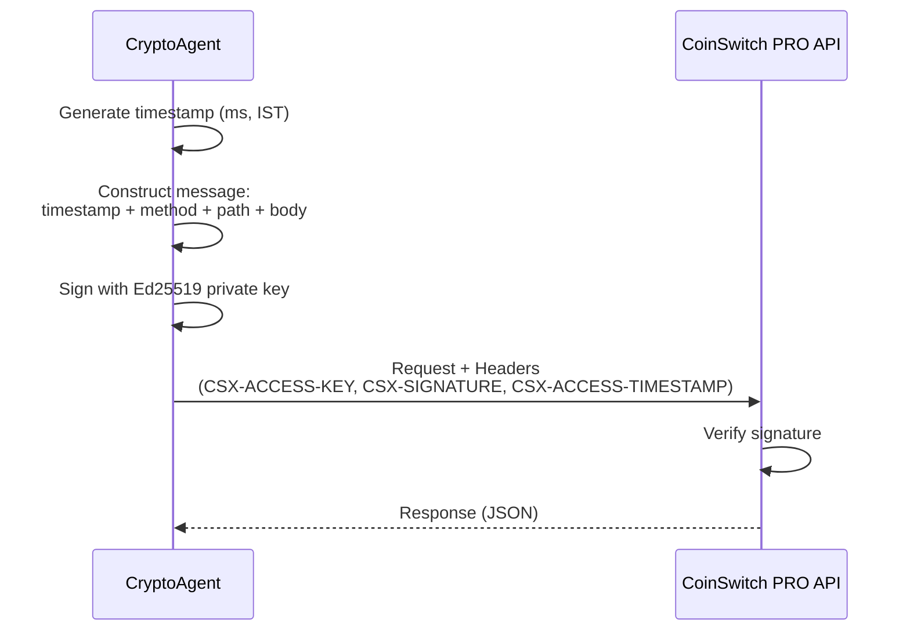
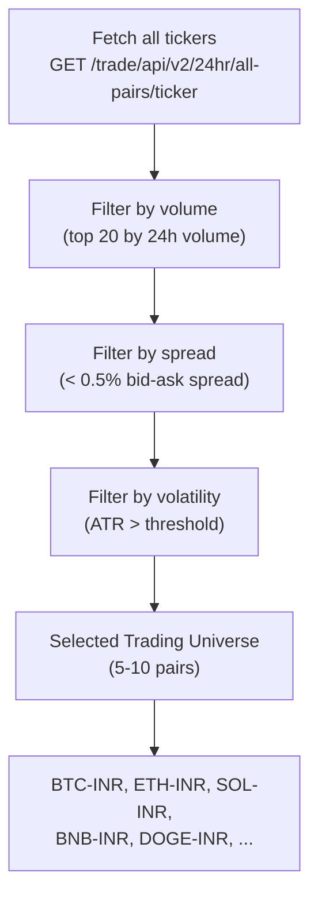
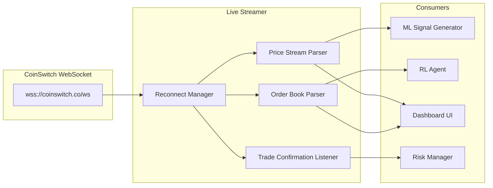
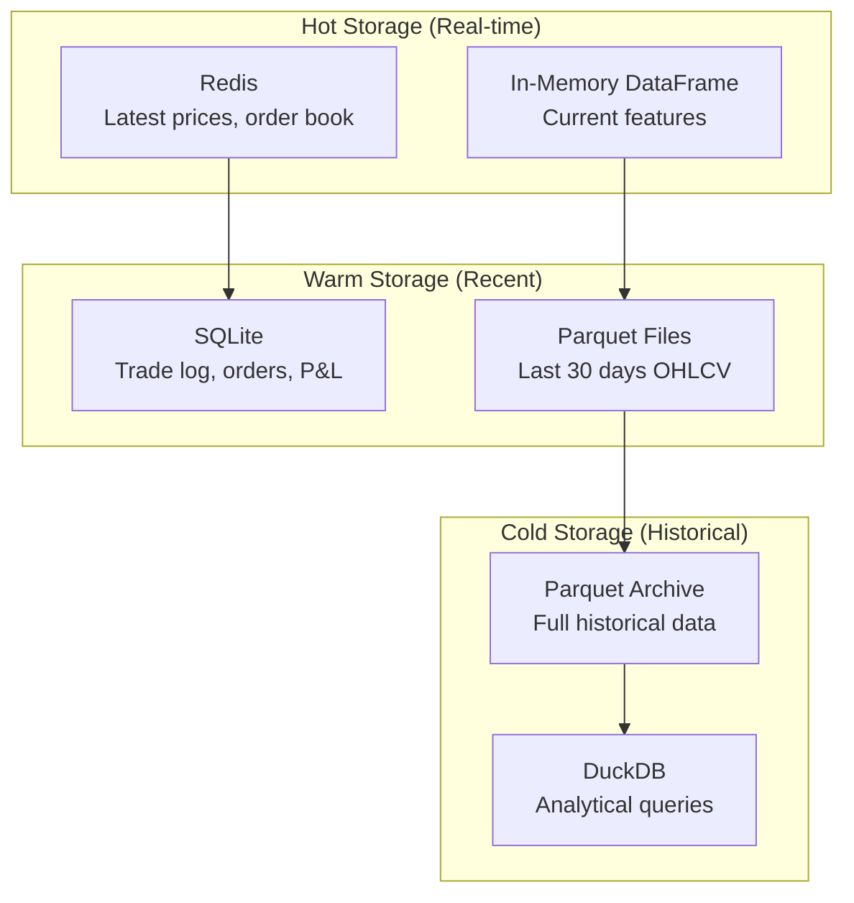
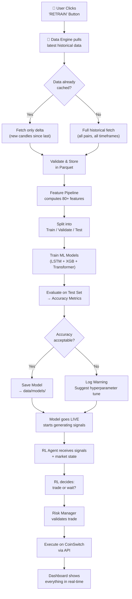
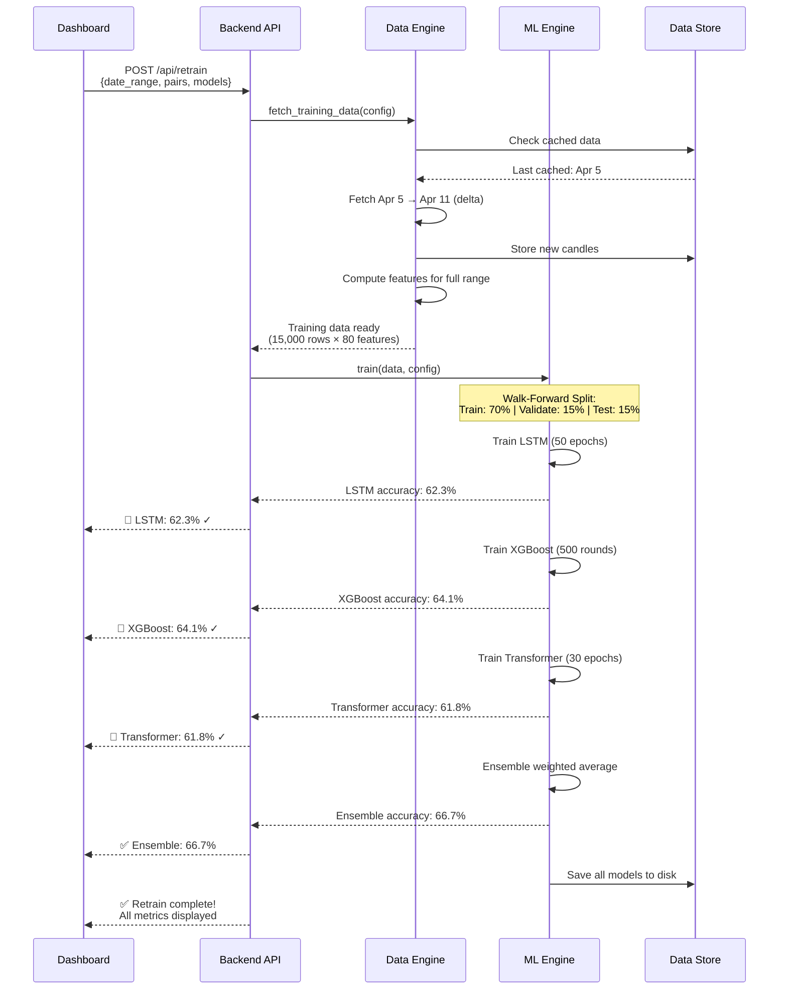

# 📡 Module 1: Data Engine — Detailed Design

> The foundation of the entire system. Every ML model, RL agent, and trading decision is only as good as the data feeding it.

---

## Table of Contents

1. [Overview](#overview)
2. [CoinSwitch API Client](#coinswitch-api-client)
3. [Historical Data Fetcher](#historical-data-fetcher)
4. [Live Data Streamer](#live-data-streamer)
5. [Sentiment Collector](#sentiment-collector)
6. [Feature Pipeline](#feature-pipeline)
7. [Data Storage Architecture](#data-storage-architecture)
8. [Data Flow Diagram](#data-flow-diagram)
9. [Retrain Data Pipeline](#retrain-data-pipeline)

---

## Overview

The Data Engine is responsible for:
- Authenticating with CoinSwitch PRO API (Ed25519 signing)
- Fetching historical OHLCV candles for all supported crypto pairs
- Streaming real-time price data via WebSocket
- Collecting external sentiment indicators
- Computing 40+ technical indicators
- Storing everything in a fast, queryable format

---

## CoinSwitch API Client

### Authentication Flow



### Client Architecture

```python
class CoinSwitchClient:
    """
    Authenticated client for CoinSwitch PRO API.
    Handles Ed25519 signing, rate limiting, and retry logic.
    """

    BASE_URL = "https://coinswitch.co"

    # Public Endpoints (No Auth Required)
    ENDPOINTS = {
        "ticker_all":   "GET  /trade/api/v2/24hr/all-pairs/ticker",
        "depth":        "GET  /trade/api/v2/depth",
        "candles":      "GET  /trade/api/v2/candles",

        # Private Endpoints (Auth Required)
        "create_order": "POST /trade/api/v2/order",
        "cancel_order": "DELETE /trade/api/v2/order",
        "open_orders":  "GET  /trade/api/v2/orders",
        "order_detail": "GET  /trade/api/v2/order",
        "portfolio":    "GET  /trade/api/v2/user/portfolio",
    }
```

### Rate Limiting Strategy

| Endpoint Type | Estimated Limit | Strategy |
|:---|:---|:---|
| Public (tickers, candles) | ~10 req/sec | Batch requests, cache 1s |
| Private (orders, portfolio) | ~5 req/sec | Queue with priority |
| WebSocket | Unlimited (subscription) | Reconnect with backoff |

```python
class RateLimiter:
    """Token bucket rate limiter with per-endpoint tracking."""

    def __init__(self):
        self.buckets = {
            "public": TokenBucket(rate=10, capacity=10),
            "private": TokenBucket(rate=5, capacity=5),
        }

    async def acquire(self, endpoint_type: str):
        bucket = self.buckets[endpoint_type]
        while not bucket.consume():
            await asyncio.sleep(0.1)
```

---

## Historical Data Fetcher

### What We Fetch

For each supported trading pair, we fetch:

| Data Point | Granularity | History Depth | Purpose |
|:---|:---|:---|:---|
| OHLCV Candles | 1m, 5m, 15m, 1h, 4h, 1d | Max available | ML training, RL environment |
| Order Book Depth | L2 (top 20 levels) | Real-time only | Liquidity assessment |
| 24h Ticker | All pairs | Current | Pair selection, volume ranking |

### Pair Selection Logic



### Historical Data Download Flow

```python
async def fetch_all_historical(self, pairs: list[str], timeframes: list[str]):
    """
    One-click historical data download for training.

    For each pair × timeframe combination:
    1. Check local cache for existing data
    2. Determine the gap (last cached → now)
    3. Fetch missing candles from API
    4. Validate data integrity (no gaps, no duplicates)
    5. Store in Parquet format
    """
    tasks = []
    for pair in pairs:
        for tf in timeframes:
            tasks.append(self._fetch_pair_candles(pair, tf))

    results = await asyncio.gather(*tasks, return_exceptions=True)
    return self._generate_download_report(results)
```

### Data Validation Checks

| Check | Action on Failure |
|:---|:---|
| Missing candles (gaps) | Interpolate if < 3 consecutive, flag if more |
| Duplicate timestamps | Deduplicate, keep latest |
| Zero/negative prices | Remove and log anomaly |
| Volume spikes (>10x avg) | Flag but keep (may be legitimate) |
| Timezone consistency | Convert all to IST (CoinSwitch standard) |

---

## Live Data Streamer

### WebSocket Architecture



### Subscription Management

```python
class LiveStreamer:
    """
    Manages WebSocket connections to CoinSwitch.
    Auto-reconnects on disconnect with exponential backoff.
    """

    async def subscribe(self, channels: list[str]):
        """
        Subscribe to multiple data channels:
        - 'ticker@BTC-INR'      → Real-time price updates
        - 'depth@BTC-INR'       → Order book changes
        - 'candle@BTC-INR@1m'   → 1-minute candle stream
        - 'user@orders'         → Order fill notifications
        - 'user@portfolio'      → Portfolio balance updates
        """

    async def _reconnect(self):
        """Exponential backoff: 1s, 2s, 4s, 8s, max 30s"""
        delay = min(30, 2 ** self.reconnect_count)
        await asyncio.sleep(delay)
        self.reconnect_count += 1
```

---

## Sentiment Collector

### Data Sources (All Free APIs)

| Source | Data | Update Frequency | API |
|:---|:---|:---|:---|
| Alternative.me | Crypto Fear & Greed Index | Daily | `api.alternative.me/fng/` |
| CoinGecko | Market cap, volume, dominance | Every 60s | `api.coingecko.com/api/v3/` |
| Reddit (pushshift) | Crypto subreddit sentiment | Every 5m | Public API |
| Twitter/X trends | Crypto trending topics | Every 15m | Free tier |

### Sentiment Feature Output

```python
@dataclass
class SentimentFeatures:
    fear_greed_index: float      # 0 (Extreme Fear) → 100 (Extreme Greed)
    fear_greed_label: str        # "Extreme Fear", "Fear", "Neutral", "Greed", "Extreme Greed"
    btc_dominance: float         # BTC market cap % (>50% = risk-off)
    total_market_cap_change: float  # 24h % change in total crypto market cap
    reddit_sentiment_score: float   # -1 (bearish) → +1 (bullish)
    social_volume_change: float     # % change in crypto mentions
    timestamp: datetime
```

---

## Feature Pipeline

### Technical Indicators (40+)

The feature pipeline computes all indicators from raw OHLCV data using `pandas-ta`:

#### Trend Indicators
| Indicator | Parameters | Signal |
|:---|:---|:---|
| SMA (Simple Moving Average) | 7, 21, 50, 200 | Crossover ↗ bullish, ↘ bearish |
| EMA (Exponential Moving Average) | 9, 21, 55 | Faster response to price changes |
| MACD | 12, 26, 9 | Signal line crossover |
| ADX (Average Directional Index) | 14 | Trend strength (>25 = strong trend) |
| Supertrend | 10, 3.0 | Clear trend direction |
| Ichimoku Cloud | 9, 26, 52 | Multi-timeframe trend + support/resistance |

#### Momentum Indicators
| Indicator | Parameters | Signal |
|:---|:---|:---|
| RSI | 14 | Overbought >70, Oversold <30 |
| Stochastic RSI | 14, 14, 3, 3 | RSI of RSI for extreme readings |
| Williams %R | 14 | Momentum with overbought/oversold |
| CCI (Commodity Channel Index) | 20 | Mean reversion signal |
| ROC (Rate of Change) | 10 | Momentum percentage |
| MFI (Money Flow Index) | 14 | Volume-weighted RSI |

#### Volatility Indicators
| Indicator | Parameters | Signal |
|:---|:---|:---|
| Bollinger Bands | 20, 2.0 | Squeeze = low vol, breakout imminent |
| ATR (Average True Range) | 14 | Position sizing, stop-loss distance |
| Keltner Channel | 20, 2.0 | Trend + volatility bands |
| Donchian Channel | 20 | Breakout trading |

#### Volume Indicators
| Indicator | Parameters | Signal |
|:---|:---|:---|
| OBV (On-Balance Volume) | — | Volume confirms price trend |
| VWAP | — | Institutional fair value |
| Volume SMA | 20 | Volume relative to average |
| CMF (Chaikin Money Flow) | 20 | Buying/selling pressure |

#### Crypto-Specific Features
| Feature | Source | Purpose |
|:---|:---|:---|
| Funding Rate | CoinSwitch Futures API | Long/short imbalance |
| Open Interest | CoinSwitch Futures API | Market participation |
| Liquidation Levels | Calculated | Key reversal zones |
| BTC Correlation | Calculated | Alt-coin beta to BTC |
| Volume Profile | Calculated | Price levels with most activity |

### Feature Pipeline Code

```python
class FeaturePipeline:
    """
    Computes 80+ features from raw OHLCV + sentiment data.
    All features are normalized and ready for ML consumption.
    """

    def compute_all(self, ohlcv_df: pd.DataFrame, sentiment: SentimentFeatures) -> pd.DataFrame:
        df = ohlcv_df.copy()

        # ---- Trend indicators ----
        df.ta.sma(length=7, append=True)
        df.ta.sma(length=21, append=True)
        df.ta.sma(length=50, append=True)
        df.ta.ema(length=9, append=True)
        df.ta.ema(length=21, append=True)
        df.ta.macd(append=True)
        df.ta.adx(append=True)
        df.ta.supertrend(append=True)

        # ---- Momentum indicators ----
        df.ta.rsi(append=True)
        df.ta.stochrsi(append=True)
        df.ta.willr(append=True)
        df.ta.cci(append=True)
        df.ta.roc(append=True)
        df.ta.mfi(append=True)

        # ---- Volatility indicators ----
        df.ta.bbands(append=True)
        df.ta.atr(append=True)
        df.ta.kc(append=True)

        # ---- Volume indicators ----
        df.ta.obv(append=True)
        df.ta.vwap(append=True)
        df.ta.cmf(append=True)

        # ---- Crypto-specific ----
        df = self._add_crypto_features(df)

        # ---- Sentiment ----
        df = self._add_sentiment_features(df, sentiment)

        # ---- Derived features ----
        df = self._add_price_patterns(df)    # Candlestick patterns
        df = self._add_multi_timeframe(df)   # MTF features
        df = self._add_lag_features(df)      # Lag-1 to Lag-5

        # ---- Normalize ----
        df = self._normalize(df)

        return df.dropna()
```

---

## Data Storage Architecture

### Storage Strategy



### File Organization

```
data/
├── historical/
│   ├── BTC-INR/
│   │   ├── 1m/
│   │   │   ├── 2024-01.parquet
│   │   │   ├── 2024-02.parquet
│   │   │   └── ...
│   │   ├── 5m/
│   │   ├── 15m/
│   │   ├── 1h/
│   │   └── 1d/
│   ├── ETH-INR/
│   │   └── ...
│   └── metadata.json          # Last fetch timestamps per pair
│
├── features/
│   ├── BTC-INR_features.parquet   # Pre-computed features
│   └── ...
│
├── sentiment/
│   └── sentiment_history.parquet  # Historical sentiment data
│
└── trades/
    └── trade_log.db               # SQLite trade database
```

### Schema: Trade Log (SQLite)

```sql
CREATE TABLE trades (
    id              INTEGER PRIMARY KEY AUTOINCREMENT,
    timestamp       DATETIME NOT NULL,
    pair            TEXT NOT NULL,           -- e.g., "BTC-INR"
    side            TEXT NOT NULL,           -- "BUY" or "SELL"
    instrument      TEXT NOT NULL,           -- "SPOT" or "FUTURES"
    leverage        REAL DEFAULT 1.0,
    quantity        REAL NOT NULL,
    entry_price     REAL NOT NULL,
    exit_price      REAL,
    pnl             REAL,
    pnl_pct         REAL,
    fees            REAL,
    signal_source   TEXT,                    -- "ML", "RL", "ENSEMBLE"
    signal_confidence REAL,
    status          TEXT DEFAULT 'OPEN',     -- "OPEN", "CLOSED", "CANCELLED"
    notes           TEXT
);

CREATE TABLE model_metrics (
    id              INTEGER PRIMARY KEY AUTOINCREMENT,
    timestamp       DATETIME NOT NULL,
    model_name      TEXT NOT NULL,           -- "lstm", "xgboost", "ensemble"
    accuracy        REAL,
    precision_val   REAL,
    recall          REAL,
    f1_score        REAL,
    sharpe_ratio    REAL,
    max_drawdown    REAL,
    win_rate        REAL,
    training_data_range TEXT,
    test_data_range TEXT
);
```

---

## Data Flow Diagram

### Complete Data Flow (Retrain → Trade)



---

## Retrain Data Pipeline

### How "One-Click Retrain" Works

When the user clicks **RETRAIN** on the dashboard:



### Retrain Configuration

```yaml
# trading_config.yaml - Retrain section

retrain:
  # Data range for training
  train_days: 90              # Use last 90 days for training
  validate_days: 15           # Validation window
  test_days: 15               # Test window (unseen data)

  # Which pairs to retrain on
  pairs: "auto"               # "auto" = top pairs by volume, or specify list

  # Model-specific settings
  lstm:
    epochs: 50
    batch_size: 64
    learning_rate: 0.001
    sequence_length: 60       # Look back 60 candles
    hidden_size: 128

  xgboost:
    n_estimators: 500
    max_depth: 6
    learning_rate: 0.05
    early_stopping_rounds: 20

  transformer:
    epochs: 30
    d_model: 64
    n_heads: 4
    n_layers: 2
    dropout: 0.1

  ensemble:
    method: "weighted_average"   # or "stacking", "voting"
    min_accuracy: 0.55           # Warn if below this

  # Schedule
  auto_retrain: false            # Set true for scheduled retraining
  retrain_interval_hours: 168    # Weekly if auto_retrain is true
```

---

## API Endpoint Reference (Data Engine)

| Endpoint | Method | Purpose |
|:---|:---|:---|
| `/api/data/pairs` | GET | List all available trading pairs |
| `/api/data/candles/{pair}` | GET | Get historical candles with params |
| `/api/data/features/{pair}` | GET | Get computed features for a pair |
| `/api/data/sentiment` | GET | Latest sentiment indicators |
| `/api/data/sync` | POST | Trigger data sync (fetch latest) |
| `/api/data/status` | GET | Data freshness & coverage report |

