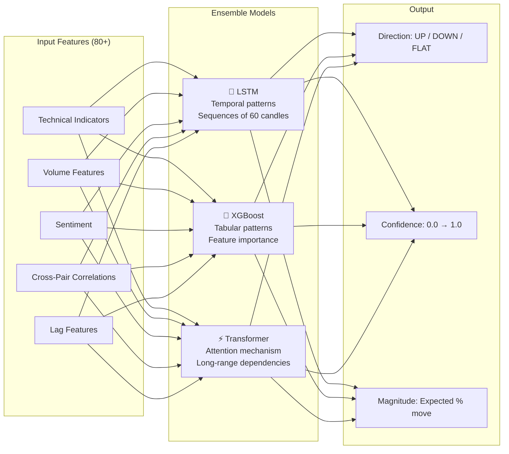
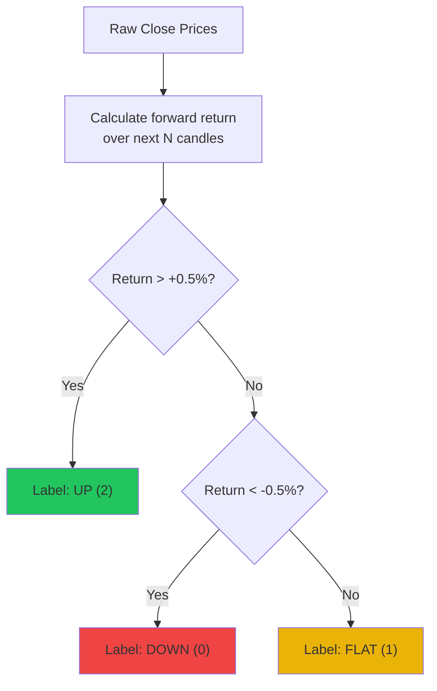
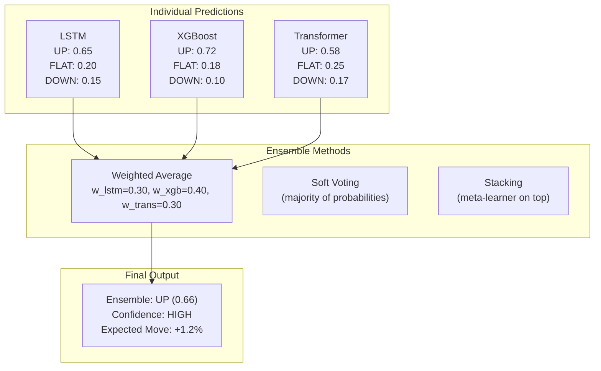
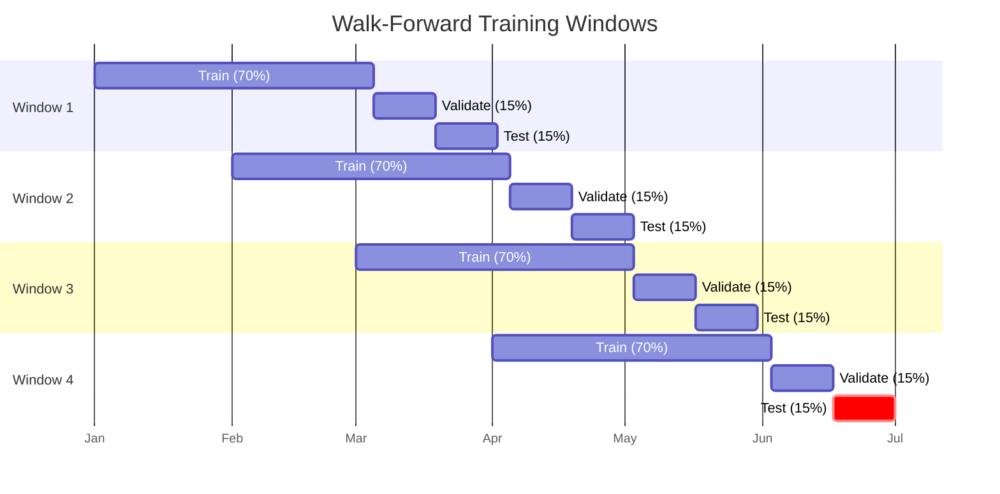
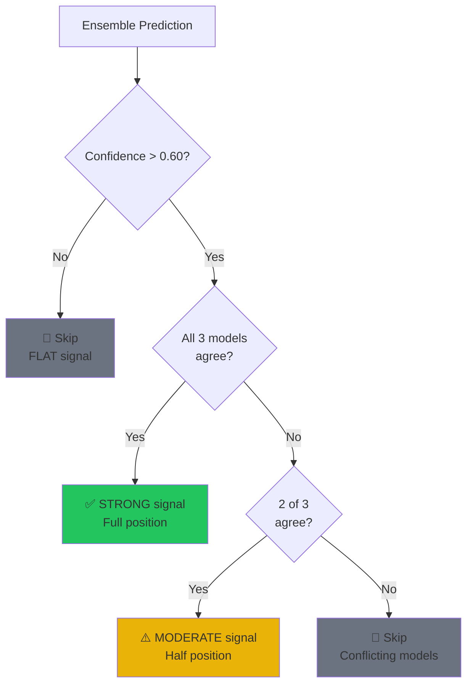

# 🧠 Module 2: ML Prediction Engine — Detailed Design

> The brain of the system. Three specialized models vote together to predict where price is going next.

---

## Table of Contents

1. [Overview](#overview)
2. [Feature Engineering](#feature-engineering)
3. [Model Architecture](#model-architecture)
4. [Walk-Forward Training](#walk-forward-training)
5. [Auto-Retrain Pipeline](#auto-retrain-pipeline)
6. [Accuracy & Evaluation Metrics](#accuracy--evaluation-metrics)
7. [Signal Generation](#signal-generation)
8. [Dashboard Integration](#dashboard-integration)

---

## Overview

The ML Prediction Engine uses an **ensemble of 3 models** to predict short-term price direction:



---

## Feature Engineering

### Feature Categories & Count

| Category | Count | Examples |
|:---|:---|:---|
| Trend Indicators | 12 | SMA(7,21,50,200), EMA(9,21,55), MACD, ADX, Supertrend |
| Momentum Indicators | 10 | RSI, StochRSI, Williams%R, CCI, ROC, MFI |
| Volatility Indicators | 8 | BBands, ATR, Keltner, Donchian |
| Volume Indicators | 6 | OBV, VWAP, CMF, Volume SMA |
| Crypto-Specific | 5 | Funding Rate, Open Interest, BTC Correlation |
| Sentiment | 6 | Fear/Greed, BTC Dominance, Social Volume |
| Price Patterns | 10 | Candlestick patterns (Doji, Hammer, Engulfing, etc.) |
| Lag Features | 15 | Lag-1 through Lag-5 for price, volume, RSI |
| Derived | 8 | Price changes (%), volatility ratio, trend strength |
| **Total** | **~80** | |

### Feature Engineering Pipeline

```python
class FeatureEngineer:
    """
    Transforms raw OHLCV + sentiment into ML-ready features.
    """

    def create_features(self, raw_df: pd.DataFrame) -> pd.DataFrame:
        df = raw_df.copy()

        # 1. Technical indicators (via pandas-ta)
        df = self._add_technical_indicators(df)

        # 2. Price-derived features
        df['returns_1'] = df['close'].pct_change(1)
        df['returns_5'] = df['close'].pct_change(5)
        df['returns_15'] = df['close'].pct_change(15)
        df['volatility_20'] = df['returns_1'].rolling(20).std()
        df['high_low_range'] = (df['high'] - df['low']) / df['close']
        df['close_open_range'] = (df['close'] - df['open']) / df['open']

        # 3. Volume features
        df['volume_sma_ratio'] = df['volume'] / df['volume'].rolling(20).mean()
        df['volume_change'] = df['volume'].pct_change()

        # 4. Cross-timeframe features
        df = self._add_multi_timeframe_features(df)

        # 5. Target variable
        df['target'] = self._create_target(df, horizon=5, threshold=0.005)

        # 6. Normalize
        feature_cols = [c for c in df.columns if c not in ['target', 'timestamp']]
        df[feature_cols] = self._robust_scale(df[feature_cols])

        return df.dropna()

    def _create_target(self, df, horizon=5, threshold=0.005):
        """
        Target: 3-class classification
        - 0 (DOWN): future return < -threshold
        - 1 (FLAT): -threshold <= future return <= +threshold
        - 2 (UP):   future return > +threshold
        """
        future_return = df['close'].pct_change(horizon).shift(-horizon)
        target = pd.Series(1, index=df.index)  # default FLAT
        target[future_return > threshold] = 2   # UP
        target[future_return < -threshold] = 0  # DOWN
        return target
```

### Target Variable Design



---

## Model Architecture

### Model 1: LSTM (Long Short-Term Memory)

**Why LSTM?** Crypto prices have temporal dependencies — patterns repeat in sequences of candles.

```
Architecture:
┌─────────────────────────────────────────┐
│  Input: (batch, 60, 80)                 │  ← 60 candles × 80 features
│  ↓                                      │
│  LSTM Layer 1: 128 units, dropout=0.2   │
│  ↓                                      │
│  LSTM Layer 2: 64 units, dropout=0.2    │
│  ↓                                      │
│  Attention Layer (self-attention)        │
│  ↓                                      │
│  Dense: 32 units, ReLU                  │
│  ↓                                      │
│  Dense: 3 units, Softmax               │  ← [DOWN, FLAT, UP] probabilities
│  ↓                                      │
│  Output: class + confidence             │
└─────────────────────────────────────────┘
```

```python
class LSTMPredictor(nn.Module):
    def __init__(self, input_dim=80, hidden_dim=128, num_layers=2, num_classes=3):
        super().__init__()
        self.lstm = nn.LSTM(
            input_size=input_dim,
            hidden_size=hidden_dim,
            num_layers=num_layers,
            batch_first=True,
            dropout=0.2,
            bidirectional=False
        )
        self.attention = nn.MultiheadAttention(
            embed_dim=hidden_dim, num_heads=4, batch_first=True
        )
        self.fc1 = nn.Linear(hidden_dim, 32)
        self.fc2 = nn.Linear(32, num_classes)
        self.dropout = nn.Dropout(0.3)

    def forward(self, x):
        lstm_out, _ = self.lstm(x)                    # (batch, 60, 128)
        attn_out, _ = self.attention(lstm_out, lstm_out, lstm_out)
        last_step = attn_out[:, -1, :]                # (batch, 128)
        x = F.relu(self.fc1(self.dropout(last_step))) # (batch, 32)
        x = self.fc2(x)                               # (batch, 3)
        return x
```

### Model 2: XGBoost (Gradient Boosting)

**Why XGBoost?** Excels at tabular data with feature importance. Catches patterns LSTM might miss.

```python
class XGBoostPredictor:
    def __init__(self):
        self.model = xgb.XGBClassifier(
            n_estimators=500,
            max_depth=6,
            learning_rate=0.05,
            subsample=0.8,
            colsample_bytree=0.8,
            min_child_weight=3,
            objective='multi:softprob',
            num_class=3,
            eval_metric='mlogloss',
            early_stopping_rounds=20,
            tree_method='hist',         # Fast training
            device='cpu',               # Use 'cuda' if GPU available
            random_state=42
        )

    def train(self, X_train, y_train, X_val, y_val):
        self.model.fit(
            X_train, y_train,
            eval_set=[(X_val, y_val)],
            verbose=10
        )
        # Feature importance for explainability
        self.feature_importance = dict(zip(
            X_train.columns,
            self.model.feature_importances_
        ))
```

### Model 3: Transformer

**Why Transformer?** Self-attention can capture long-range dependencies that LSTM struggles with.

```
Architecture:
┌─────────────────────────────────────────┐
│  Input: (batch, 60, 80)                 │
│  ↓                                      │
│  Positional Encoding                    │
│  ↓                                      │
│  Transformer Encoder (2 layers)         │
│  │  └─ Multi-Head Attention (4 heads)   │
│  │  └─ Feed-Forward (d_model=64)        │
│  │  └─ LayerNorm + Dropout              │
│  ↓                                      │
│  Global Average Pooling                 │
│  ↓                                      │
│  Dense: 32, ReLU                        │
│  ↓                                      │
│  Dense: 3, Softmax                      │
└─────────────────────────────────────────┘
```

### Ensemble Strategy



```python
class EnsemblePredictor:
    """
    Combines predictions from LSTM, XGBoost, and Transformer.
    Weights are dynamically adjusted based on recent performance.
    """

    def __init__(self):
        self.models = {
            'lstm': LSTMPredictor(),
            'xgboost': XGBoostPredictor(),
            'transformer': TransformerPredictor()
        }
        # Dynamic weights based on recent accuracy
        self.weights = {'lstm': 0.30, 'xgboost': 0.40, 'transformer': 0.30}

    def predict(self, features):
        predictions = {}
        for name, model in self.models.items():
            pred = model.predict_proba(features)
            predictions[name] = pred

        # Weighted average of probabilities
        ensemble_probs = sum(
            self.weights[name] * pred
            for name, pred in predictions.items()
        )

        predicted_class = np.argmax(ensemble_probs)
        confidence = ensemble_probs[predicted_class]

        return {
            'direction': ['DOWN', 'FLAT', 'UP'][predicted_class],
            'confidence': float(confidence),
            'individual': predictions,
            'weights': self.weights
        }

    def update_weights(self, recent_accuracies: dict):
        """Dynamically reweight models based on recent performance."""
        total = sum(recent_accuracies.values())
        self.weights = {k: v / total for k, v in recent_accuracies.items()}
```

---

## Walk-Forward Training

### Why Walk-Forward?

Traditional train/test split doesn't work for time-series because:
- Future data leaks into training → overfitting
- Market regimes change → model needs to adapt



```python
class WalkForwardTrainer:
    """
    Implements walk-forward optimization to prevent overfitting.
    """

    def __init__(self, train_pct=0.70, val_pct=0.15, test_pct=0.15,
                 step_size_days=30, window_size_days=90):
        self.train_pct = train_pct
        self.val_pct = val_pct
        self.test_pct = test_pct
        self.step_size = step_size_days
        self.window_size = window_size_days

    def generate_windows(self, data: pd.DataFrame) -> list[dict]:
        """Generate rolling train/validate/test windows."""
        windows = []
        total_days = (data.index[-1] - data.index[0]).days

        start = data.index[0]
        while True:
            end = start + pd.Timedelta(days=self.window_size)
            if end > data.index[-1]:
                break

            train_end = start + pd.Timedelta(days=int(self.window_size * self.train_pct))
            val_end = train_end + pd.Timedelta(days=int(self.window_size * self.val_pct))

            windows.append({
                'train': data[start:train_end],
                'validate': data[train_end:val_end],
                'test': data[val_end:end]
            })

            start += pd.Timedelta(days=self.step_size)

        return windows

    def train_all_windows(self, model, windows):
        """Train model on each window and collect metrics."""
        results = []
        for i, window in enumerate(windows):
            print(f"Training window {i+1}/{len(windows)}...")

            model.fit(window['train'], window['validate'])
            metrics = model.evaluate(window['test'])

            results.append({
                'window': i,
                'accuracy': metrics['accuracy'],
                'f1': metrics['f1_score'],
                'sharpe': metrics['sharpe_ratio'],
                'max_drawdown': metrics['max_drawdown']
            })

        return results
```

---

## Auto-Retrain Pipeline

### One-Click Flow

```mermaid
statechart-v2
    [*] --> Idle
    Idle --> FetchingData: User clicks RETRAIN
    FetchingData --> ComputingFeatures: Data synced
    ComputingFeatures --> SplittingData: Features ready
    SplittingData --> TrainingLSTM: Walk-forward split done
    TrainingLSTM --> TrainingXGBoost: LSTM trained
    TrainingXGBoost --> TrainingTransformer: XGBoost trained
    TrainingTransformer --> EnsembleTuning: Transformer trained
    EnsembleTuning --> Evaluating: Ensemble weights set
    Evaluating --> SaveModels: Accuracy OK
    Evaluating --> WarningUser: Accuracy LOW
    WarningUser --> SaveModels: User confirms
    SaveModels --> Idle: Models saved & deployed

    note right of FetchingData: Streams progress to dashboard
    note right of TrainingLSTM: Shows loss curve in real-time
    note right of Evaluating: Displays all metrics
```

### What The User Sees During Retrain

```
╔══════════════════════════════════════════════════════════════╗
║  🔄 RETRAIN IN PROGRESS                                     ║
╠══════════════════════════════════════════════════════════════╣
║                                                              ║
║  📡 Data Sync ...................... ✅ Complete (15,420 rows)║
║  ⚙️  Feature Engineering .......... ✅ Complete (80 features) ║
║  📊 Walk-Forward Split ............ ✅ 4 windows created      ║
║                                                              ║
║  🔮 LSTM Training ...............   ██████████░░ 78%         ║
║     ├─ Epoch: 39/50                                          ║
║     ├─ Train Loss: 0.682                                     ║
║     ├─ Val Loss: 0.701                                       ║
║     └─ Val Accuracy: 61.2%                                   ║
║                                                              ║
║  🌲 XGBoost ...................... ⏳ Pending                 ║
║  ⚡ Transformer .................. ⏳ Pending                 ║
║  🎯 Ensemble ..................... ⏳ Pending                 ║
║                                                              ║
║  [LIVE LOSS CHART HERE - Training vs Validation curves]      ║
║                                                              ║
╚══════════════════════════════════════════════════════════════╝
```

---

## Accuracy & Evaluation Metrics

### Metrics We Track

| Metric | What It Measures | Target |
|:---|:---|:---|
| **Accuracy** | % of correct direction predictions | > 55% |
| **Precision** | Of predicted UP, how many were actually UP | > 55% |
| **Recall** | Of actual UP moves, how many did we catch | > 50% |
| **F1 Score** | Harmonic mean of precision & recall | > 52% |
| **Sharpe Ratio** | Risk-adjusted returns | > 1.0 |
| **Win Rate** | % of profitable trades from signals | > 50% |
| **Max Drawdown** | Largest peak-to-trough decline | < 30% |
| **Profit Factor** | Gross profit / Gross loss | > 1.5 |
| **Calmar Ratio** | Annual return / Max drawdown | > 1.0 |

> [!NOTE]
> In crypto trading, even 55% directional accuracy with proper risk management (good risk/reward ratio) can be consistently profitable. We don't need 90%+ accuracy — we need an **edge**.

### Evaluation Report (Auto-Generated)

```python
class ModelEvaluator:
    def generate_report(self, model, test_data) -> dict:
        predictions = model.predict(test_data.features)
        actuals = test_data.targets

        report = {
            'timestamp': datetime.now(),
            'model_name': model.name,
            'test_range': f"{test_data.start} → {test_data.end}",
            'n_samples': len(test_data),

            # Classification metrics
            'accuracy': accuracy_score(actuals, predictions),
            'precision': precision_score(actuals, predictions, average='weighted'),
            'recall': recall_score(actuals, predictions, average='weighted'),
            'f1_score': f1_score(actuals, predictions, average='weighted'),

            # Confusion matrix
            'confusion_matrix': confusion_matrix(actuals, predictions).tolist(),

            # Trading metrics (backtested)
            'sharpe_ratio': self._calc_sharpe(predictions, test_data),
            'max_drawdown': self._calc_max_drawdown(predictions, test_data),
            'win_rate': self._calc_win_rate(predictions, test_data),
            'profit_factor': self._calc_profit_factor(predictions, test_data),
            'total_trades': self._count_trades(predictions),
            'avg_trade_pnl': self._calc_avg_pnl(predictions, test_data),

            # Feature importance (XGBoost)
            'top_features': self._get_top_features(model, n=10),
        }

        return report
```

### Confusion Matrix Visualization

```
                    Predicted
                DOWN   FLAT    UP
Actual  DOWN  [ 142    38    20 ]   ← True DOWN captures
        FLAT  [  35   180    35 ]   ← True FLAT captures
        UP    [  18    40   148 ]   ← True UP captures

Accuracy: 62.4%  |  UP Precision: 72.9%  |  DOWN Recall: 71.0%
```

---

## Signal Generation

### Signal Output Format

```python
@dataclass
class TradingSignal:
    timestamp: datetime
    pair: str                    # "BTC-INR"
    direction: str               # "UP", "DOWN", "FLAT"
    confidence: float            # 0.0 → 1.0
    expected_move_pct: float     # Expected % price change
    timeframe: str               # "5m", "15m", "1h"
    model_agreement: int         # How many models agree (1, 2, or 3)

    # Individual model predictions
    lstm_prediction: str
    lstm_confidence: float
    xgboost_prediction: str
    xgboost_confidence: float
    transformer_prediction: str
    transformer_confidence: float

    # Actionability
    is_actionable: bool          # True if confidence > threshold
    suggested_instrument: str    # "SPOT" or "FUTURES"
    suggested_leverage: int      # 1x, 2x, 4x, 8x

    def to_dict(self) -> dict:
        return asdict(self)
```

### Signal Filtering Rules



---

## Dashboard Integration

### What's Shown on Dashboard for ML Engine

| UI Component | Data Displayed |
|:---|:---|
| **Signal Panel** | Current signal: direction, confidence, model agreement |
| **Prediction Chart** | Price chart with predicted direction overlay |
| **Accuracy History** | Rolling 30-day accuracy for each model |
| **Feature Importance** | Top 10 features driving current prediction |
| **Training Curves** | Loss and accuracy during retrain (live streamed) |
| **Confusion Matrix** | Interactive heatmap of latest test results |
| **Model Comparison** | Side-by-side performance of LSTM vs XGB vs Transformer |

### API Endpoints (ML Engine)

| Endpoint | Method | Purpose |
|:---|:---|:---|
| `/api/ml/signal/{pair}` | GET | Get latest signal for a pair |
| `/api/ml/signals/all` | GET | Get signals for all tracked pairs |
| `/api/ml/metrics` | GET | Get accuracy metrics for all models |
| `/api/ml/retrain` | POST | Trigger retrain (with config) |
| `/api/ml/retrain/status` | GET | Get current retrain progress |
| `/api/ml/retrain/history` | GET | Past retrain runs and results |
| `/api/ml/features/{pair}` | GET | Current feature values for a pair |
| `/api/ml/importance` | GET | Feature importance rankings |

