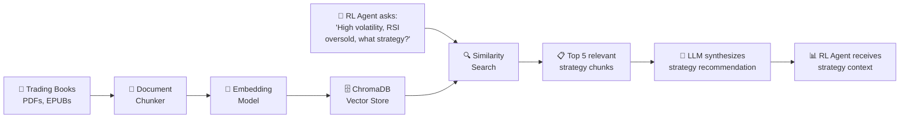
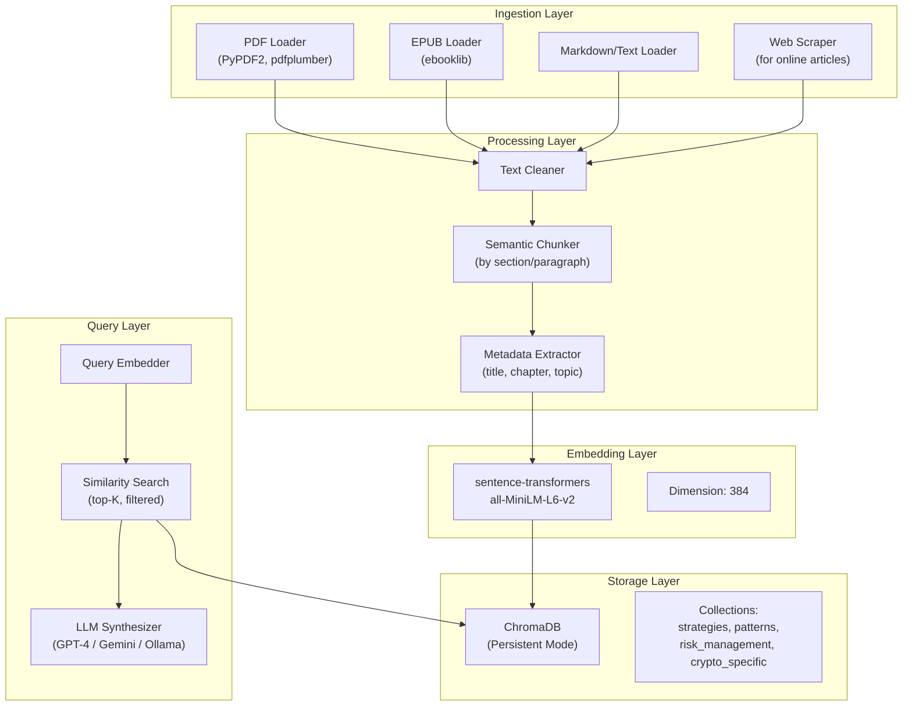
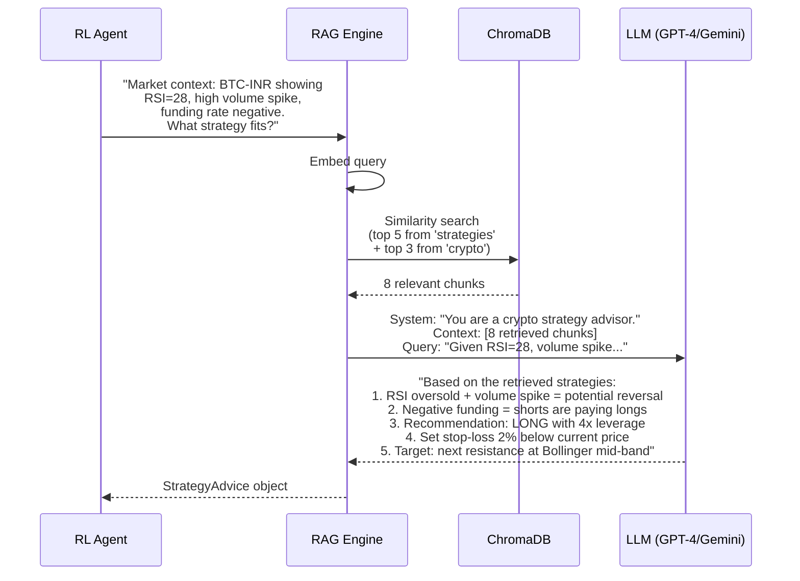
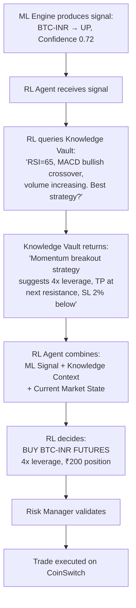

# 📚 Module 3: Knowledge Vault — Detailed Design

> A vector database of trading wisdom. The AI doesn't just predict — it **reasons** using strategies from books, research, and proven patterns.

---

## Table of Contents

1. [Overview](#overview)
2. [Architecture](#architecture)
3. [Document Ingestion](#document-ingestion)
4. [Embedding & Indexing](#embedding--indexing)
5. [RAG Query Engine](#rag-query-engine)
6. [Strategy Library](#strategy-library)
7. [Integration with ML/RL](#integration-with-mlrl)
8. [Knowledge Sources](#knowledge-sources)

---

## Overview

The Knowledge Vault is a **Retrieval-Augmented Generation (RAG)** system that:

1. **Ingests** trading books, strategy documents, research papers
2. **Chunks & embeds** them into a persistent vector database
3. **Retrieves** relevant strategies when the RL agent needs guidance
4. **Augments** the AI's decision-making with proven trading wisdom



---

## Architecture

### Component Breakdown



---

## Document Ingestion

### Supported Formats

| Format | Library | Use Case |
|:---|:---|:---|
| PDF | `pdfplumber` + `PyPDF2` | Trading books, research papers |
| EPUB | `ebooklib` | E-books |
| Markdown | Built-in | Strategy notes, documentation |
| Plain Text | Built-in | Scraped articles |
| Web URLs | `trafilatura` | Online trading guides |

### Ingestion Pipeline

```python
class DocumentIngester:
    """
    Loads trading documents from multiple sources and formats.
    """

    def __init__(self, knowledge_dir: str = "data/knowledge"):
        self.knowledge_dir = Path(knowledge_dir)
        self.loaders = {
            '.pdf': self._load_pdf,
            '.epub': self._load_epub,
            '.md': self._load_markdown,
            '.txt': self._load_text,
        }

    def ingest_all(self) -> list[Document]:
        """Load all documents from the knowledge directory."""
        documents = []
        for file in self.knowledge_dir.rglob("*"):
            if file.suffix in self.loaders:
                print(f"📖 Loading: {file.name}")
                docs = self.loaders[file.suffix](file)
                documents.extend(docs)

        print(f"✅ Loaded {len(documents)} document sections")
        return documents

    def _load_pdf(self, path: Path) -> list[Document]:
        """Extract text from PDF, preserving structure."""
        import pdfplumber
        documents = []
        with pdfplumber.open(path) as pdf:
            for i, page in enumerate(pdf.pages):
                text = page.extract_text()
                if text and len(text.strip()) > 50:  # Skip empty pages
                    documents.append(Document(
                        content=text,
                        metadata={
                            'source': path.name,
                            'page': i + 1,
                            'type': 'trading_book'
                        }
                    ))
        return documents
```

### Semantic Chunking

```python
class SemanticChunker:
    """
    Chunks documents by semantic meaning, not just character count.
    Preserves context by overlapping chunks.
    """

    def __init__(self, chunk_size=500, overlap=100):
        self.chunk_size = chunk_size    # ~500 words per chunk
        self.overlap = overlap          # 100 word overlap

    def chunk(self, document: Document) -> list[Chunk]:
        # Strategy 1: Split by headers/sections first
        sections = self._split_by_headers(document.content)

        chunks = []
        for section in sections:
            if len(section.split()) <= self.chunk_size:
                chunks.append(Chunk(
                    content=section,
                    metadata={
                        **document.metadata,
                        'chunk_type': 'section'
                    }
                ))
            else:
                # Sub-split large sections with overlap
                sub_chunks = self._sliding_window(section)
                chunks.extend(sub_chunks)

        return chunks
```

---

## Embedding & Indexing

### Embedding Model

| Model | Dimensions | Speed | Quality |
|:---|:---|:---|:---|
| `all-MiniLM-L6-v2` ⭐ | 384 | Fast | Good (default) |
| `all-mpnet-base-v2` | 768 | Medium | Better |
| `BGE-large-en-v1.5` | 1024 | Slow | Best |

```python
class ChunkEmbedder:
    """Embeds text chunks using sentence-transformers."""

    def __init__(self, model_name="all-MiniLM-L6-v2"):
        from sentence_transformers import SentenceTransformer
        self.model = SentenceTransformer(model_name)

    def embed_chunks(self, chunks: list[Chunk]) -> list[tuple[Chunk, list[float]]]:
        texts = [chunk.content for chunk in chunks]
        embeddings = self.model.encode(
            texts,
            batch_size=32,
            show_progress_bar=True,
            normalize_embeddings=True
        )
        return list(zip(chunks, embeddings.tolist()))
```

### ChromaDB Collections

```python
class VectorStore:
    """Persistent ChromaDB vector store for trading knowledge."""

    def __init__(self, persist_dir="data/knowledge/chromadb"):
        import chromadb
        self.client = chromadb.PersistentClient(path=persist_dir)

        # Separate collections for different knowledge types
        self.collections = {
            'strategies': self.client.get_or_create_collection(
                name="trading_strategies",
                metadata={"description": "General trading strategies and methods"}
            ),
            'patterns': self.client.get_or_create_collection(
                name="chart_patterns",
                metadata={"description": "Chart patterns, candlestick patterns"}
            ),
            'risk': self.client.get_or_create_collection(
                name="risk_management",
                metadata={"description": "Position sizing, risk rules, portfolio management"}
            ),
            'crypto': self.client.get_or_create_collection(
                name="crypto_specific",
                metadata={"description": "Crypto-specific strategies, DeFi, on-chain"}
            ),
        }

    def add_chunks(self, collection_name: str, chunks_with_embeddings):
        collection = self.collections[collection_name]

        ids = [f"{collection_name}_{i}" for i in range(len(chunks_with_embeddings))]
        documents = [c.content for c, _ in chunks_with_embeddings]
        embeddings = [e for _, e in chunks_with_embeddings]
        metadatas = [c.metadata for c, _ in chunks_with_embeddings]

        collection.add(
            ids=ids,
            documents=documents,
            embeddings=embeddings,
            metadatas=metadatas
        )

    def search(self, collection_name: str, query_embedding: list[float],
               n_results: int = 5, filter_metadata: dict = None):
        collection = self.collections[collection_name]
        results = collection.query(
            query_embeddings=[query_embedding],
            n_results=n_results,
            where=filter_metadata
        )
        return results
```

---

## RAG Query Engine

### How The RL Agent Queries Knowledge



### RAG Engine Implementation

```python
class RAGQueryEngine:
    """
    Retrieval-Augmented Generation for trading strategy advice.
    """

    def __init__(self, vector_store: VectorStore, embedder: ChunkEmbedder):
        self.vs = vector_store
        self.embedder = embedder
        # LLM can be OpenAI, Gemini, or local Ollama
        self.llm = self._init_llm()

    def query(self, market_context: dict, question: str) -> StrategyAdvice:
        """
        Query the knowledge base for strategy advice.

        Args:
            market_context: Current market state (pair, indicators, etc.)
            question: Specific strategy question

        Returns:
            StrategyAdvice with recommendation and sources
        """
        # 1. Build enriched query
        enriched_query = self._build_query(market_context, question)

        # 2. Embed the query
        query_embedding = self.embedder.model.encode(enriched_query).tolist()

        # 3. Search multiple collections
        strategy_results = self.vs.search('strategies', query_embedding, n_results=5)
        crypto_results = self.vs.search('crypto', query_embedding, n_results=3)
        risk_results = self.vs.search('risk', query_embedding, n_results=2)

        # 4. Combine retrieved context
        context_chunks = (
            strategy_results['documents'][0] +
            crypto_results['documents'][0] +
            risk_results['documents'][0]
        )

        # 5. Generate advice via LLM
        advice = self._generate_advice(market_context, question, context_chunks)

        return StrategyAdvice(
            recommendation=advice['recommendation'],
            confidence=advice['confidence'],
            reasoning=advice['reasoning'],
            suggested_position=advice['position'],
            suggested_leverage=advice['leverage'],
            sources=[m['source'] for m in strategy_results['metadatas'][0]]
        )

    def _generate_advice(self, context, question, chunks):
        prompt = f"""You are an expert crypto trading strategist.

Given the current market context:
{json.dumps(context, indent=2)}

And relevant knowledge from trading strategy documents:
{chr(10).join(f'[{i+1}] {chunk}' for i, chunk in enumerate(chunks))}

Question: {question}

Provide a concise trading recommendation with:
1. Direction (LONG / SHORT / WAIT)
2. Confidence level (0.0-1.0)
3. Suggested leverage (1x-8x)
4. Key reasoning (2-3 bullet points)
5. Risk considerations
"""
        return self.llm.generate(prompt)
```

---

## Strategy Library

### Pre-Loaded Strategies

The Knowledge Vault ships with these built-in strategy documents:

| # | Strategy | Category | Description |
|:---|:---|:---|:---|
| 1 | RSI Divergence | Momentum | Trade when RSI diverges from price |
| 2 | MACD Crossover | Trend | Enter on signal line crossover |
| 3 | Bollinger Squeeze | Volatility | Trade breakouts from low-vol periods |
| 4 | Support/Resistance | Structure | Use key levels for entries |
| 5 | EMA Ribbon | Trend | Multiple EMAs for trend strength |
| 6 | Volume Profile | Volume | Trade high-volume nodes |
| 7 | Funding Rate Arb | Crypto-Specific | Trade funding rate imbalances |
| 8 | Liquidation Cascade | Crypto-Specific | Anticipate liquidation-driven moves |
| 9 | DCA on Dips | Risk Mgmt | Dollar-cost average into weakness |
| 10 | Grid Trading | Range-Bound | Auto buy low / sell high in ranges |
| 11 | Breakout Momentum | Trend | Enter on volume-confirmed breakouts |
| 12 | Mean Reversion | Range-Bound | Fade extreme moves |

### Built-In Strategy Document Example

```markdown
## Strategy: RSI Divergence Trading

### Concept
When price makes a new low but RSI makes a higher low,
it signals weakening selling pressure → potential reversal.

### Entry Rules
1. Price must be at or near support level
2. RSI(14) must be below 35
3. RSI must show higher low vs previous low
4. Volume must increase on the divergence candle

### Exit Rules
1. Take profit at next resistance level or +10% move
2. Stop loss 2% below the divergence low
3. Trail stop after 5% profit

### Risk Parameters
- Max position: 20% of capital
- Leverage: 2-4x (moderate confidence)
- Best timeframe: 1h, 4h
- Win rate: ~55-60%

### Crypto-Specific Notes
- Works best in BTC-dominated markets
- Avoid during extreme FUD events
- More reliable when funding rate is negative (for LONG trades)
```

---

## Knowledge Sources

### Recommended Books & Documents to Load

| # | Source | Type | Content |
|:---|:---|:---|:---|
| 1 | "Technical Analysis of Financial Markets" - Murphy | PDF | Comprehensive TA reference |
| 2 | "Trading in the Zone" - Mark Douglas | PDF | Trading psychology |
| 3 | "Crypto Trading Guide" - Binance Academy | Web | Crypto-specific strategies |
| 4 | "Advances in Financial ML" - Lopez de Prado | PDF | ML for finance |
| 5 | CoinSwitch PRO Help Docs | Web | Platform-specific knowledge |
| 6 | Investopedia Crypto Section | Web | General crypto education |
| 7 | TradingView Strategy Library | Web | Community strategies |
| 8 | Academic papers on crypto trading | PDF | Research-backed methods |

> [!TIP]
> Drop any PDF or EPUB into `data/knowledge/` and the system will automatically ingest it on next startup or when you click "Refresh Knowledge Base" on the dashboard.

---

## Integration with ML/RL

### How Knowledge Flows Into Decisions



### API Endpoints (Knowledge Vault)

| Endpoint | Method | Purpose |
|:---|:---|:---|
| `/api/knowledge/query` | POST | Query the knowledge base |
| `/api/knowledge/ingest` | POST | Ingest new documents |
| `/api/knowledge/refresh` | POST | Re-index all documents |
| `/api/knowledge/stats` | GET | Collection stats (doc count, etc.) |
| `/api/knowledge/collections` | GET | List all collections |
| `/api/knowledge/search` | POST | Raw similarity search |

