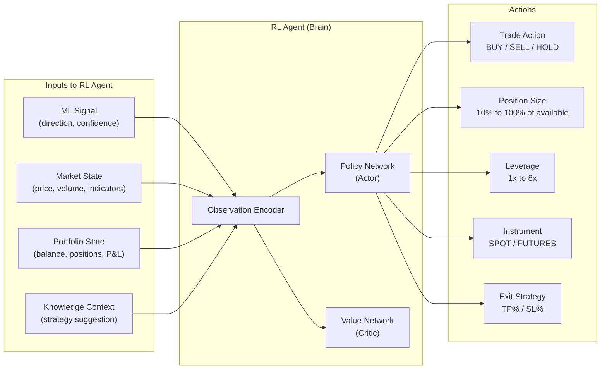
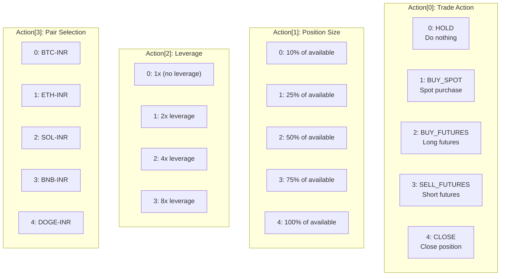
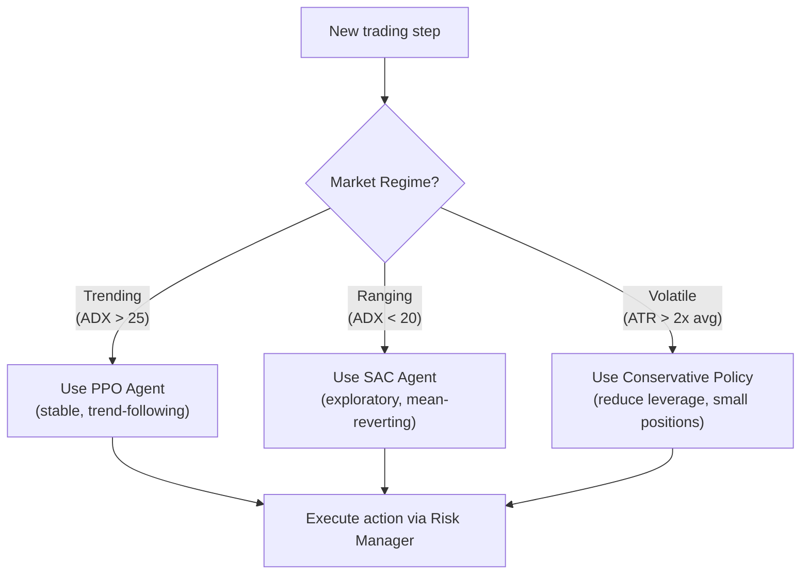
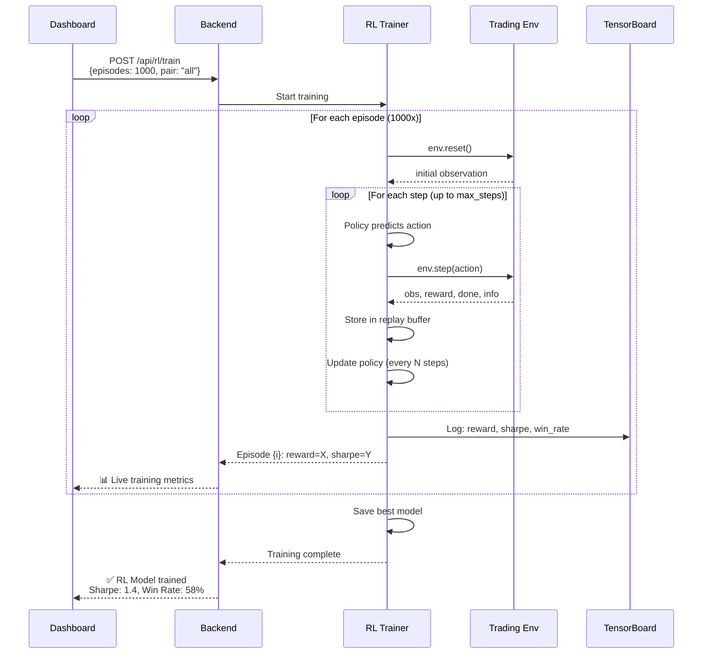
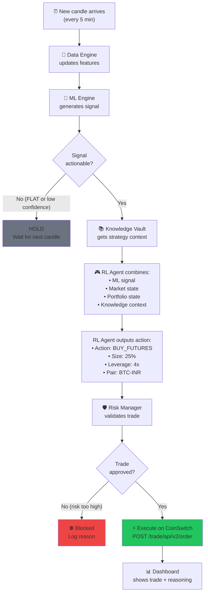

# 🎮 Module 4: RL Execution Engine — Detailed Design

> The RL agent doesn't just follow signals — it **learns** the optimal way to trade: when to enter, how much to size, what leverage to use, and when to exit.

---

## Table of Contents

1. [Overview](#overview)
2. [Trading Environment (Gymnasium)](#trading-environment-gymnasium)
3. [State Space](#state-space)
4. [Action Space](#action-space)
5. [Reward Function](#reward-function)
6. [PPO Agent](#ppo-agent)
7. [SAC Agent](#sac-agent)
8. [Training Pipeline](#training-pipeline)
9. [Backtesting & Evaluation](#backtesting--evaluation)
10. [Integration Flow](#integration-flow)

---

## Overview

The RL Execution Engine is the **decision-making core** that learns optimal trading policies through trial and error. It receives signals from the ML engine and knowledge context from the Knowledge Vault, then decides:

- **Whether** to trade (or wait for better opportunity)
- **How much** to allocate (position sizing)
- **What leverage** to use (2x, 4x, 8x, or more)
- **Which instrument** to trade (spot vs futures)
- **When to exit** (take profit, stop loss, or hold)



---

## Trading Environment (Gymnasium)

### Environment Design

```python
import gymnasium as gym
import numpy as np
from gymnasium import spaces

class CryptoTradingEnv(gym.Env):
    """
    Custom Gymnasium environment simulating CoinSwitch crypto trading.

    Simulates realistic trading with:
    - Transaction fees (CoinSwitch maker/taker)
    - Slippage model
    - Leverage and margin requirements
    - Liquidation mechanics for futures
    - Funding rates for perpetual futures
    """

    metadata = {'render_modes': ['human', 'json']}

    def __init__(self, config: dict):
        super().__init__()

        # === Configuration ===
        self.initial_balance = config.get('initial_balance', 2000)  # ₹2000
        self.min_trade_size = config.get('min_trade_size', 100)     # ₹100
        self.max_leverage = config.get('max_leverage', 8)
        self.maker_fee = config.get('maker_fee', 0.001)  # 0.1%
        self.taker_fee = config.get('taker_fee', 0.001)  # 0.1%
        self.target_profit_pct = config.get('target_profit', 0.10)  # 10%
        self.stop_loss_pct = config.get('stop_loss', 0.30)          # 30%
        self.max_positions = config.get('max_positions', 3)

        # === State dimensions ===
        self.n_features = config.get('n_features', 80)
        self.n_pairs = config.get('n_pairs', 5)

        # === Observation Space ===
        # [market_features, portfolio_state, signal_features]
        obs_dim = self.n_features + 15 + 10  # 80 + 15 + 10 = 105
        self.observation_space = spaces.Box(
            low=-np.inf, high=np.inf,
            shape=(obs_dim,), dtype=np.float32
        )

        # === Action Space (Multi-Discrete) ===
        # Action[0]: Trade action    (0=HOLD, 1=BUY_SPOT, 2=BUY_FUTURES, 3=SELL, 4=CLOSE)
        # Action[1]: Position size   (0=10%, 1=25%, 2=50%, 3=75%, 4=100%)
        # Action[2]: Leverage        (0=1x, 1=2x, 2=4x, 3=8x)
        # Action[3]: Pair index      (0-4 for each tracked pair)
        self.action_space = spaces.MultiDiscrete([5, 5, 4, self.n_pairs])

        # === Internal state ===
        self.balance = self.initial_balance
        self.positions = {}  # pair -> Position
        self.trade_history = []
        self.step_count = 0

    def reset(self, seed=None, options=None):
        super().reset(seed=seed)
        self.balance = self.initial_balance
        self.positions = {}
        self.trade_history = []
        self.step_count = 0
        self.data_cursor = 0
        return self._get_observation(), {}

    def step(self, action):
        # 1. Parse action
        trade_action, size_idx, leverage_idx, pair_idx = action
        position_size_pct = [0.10, 0.25, 0.50, 0.75, 1.00][size_idx]
        leverage = [1, 2, 4, 8][leverage_idx]
        pair = self.tracked_pairs[pair_idx]

        # 2. Execute action
        reward = 0
        if trade_action == 0:  # HOLD
            reward = self._hold_reward()
        elif trade_action in [1, 2]:  # BUY (spot or futures)
            instrument = 'SPOT' if trade_action == 1 else 'FUTURES'
            reward = self._open_position(pair, 'BUY', instrument,
                                         position_size_pct, leverage)
        elif trade_action == 3:  # SELL
            reward = self._open_position(pair, 'SELL', 'FUTURES',
                                         position_size_pct, leverage)
        elif trade_action == 4:  # CLOSE existing position
            reward = self._close_position(pair)

        # 3. Update market state (advance one candle)
        self.step_count += 1
        self.data_cursor += 1

        # 4. Check for liquidation
        self._check_liquidations()

        # 5. Check termination
        terminated = (
            self.balance <= 0 or
            self.data_cursor >= len(self.data) - 1
        )
        truncated = self.step_count >= self.max_steps

        # 6. Get new observation
        obs = self._get_observation()
        info = self._get_info()

        return obs, reward, terminated, truncated, info
```

---

## State Space

### Observation Vector (105 dimensions)

```
Observation = [Market Features (80) | Portfolio State (15) | Signal Features (10)]
```

#### Market Features (80 dims)

| Feature Group | Dims | Description |
|:---|:---|:---|
| Technical Indicators | 40 | RSI, MACD, BBands, ATR, etc. (all normalized) |
| Price Features | 10 | Returns (1,5,15,30), volatility, range |
| Volume Features | 8 | Volume ratio, OBV, CMF, volume change |
| Crypto Features | 5 | Funding rate, open interest, BTC correlation |
| Sentiment | 6 | Fear/Greed, social volume, BTC dominance |
| Cross-Pair | 6 | Correlation matrix summary |
| Multi-Timeframe | 5 | Higher TF trend signals |

#### Portfolio State (15 dims)

| Feature | Description |
|:---|:---|
| `balance_ratio` | Current balance / Initial balance |
| `total_equity_ratio` | (Balance + Unrealized PnL) / Initial |
| `n_open_positions` | Number of open positions (0-5) |
| `total_exposure` | Sum of all position values / Balance |
| `avg_leverage` | Weighted average leverage of positions |
| `max_drawdown` | Current max drawdown from peak |
| `win_streak` | Consecutive winning trades |
| `loss_streak` | Consecutive losing trades |
| `win_rate` | Rolling win rate (last 20 trades) |
| `avg_hold_time` | Average position hold time (normalized) |
| `unrealized_pnl` | Total unrealized P&L (normalized) |
| `position_1_pnl` | P&L of position 1 (if exists) |
| `position_2_pnl` | P&L of position 2 |
| `position_3_pnl` | P&L of position 3 |
| `time_in_episode` | Step count / max steps |

#### Signal Features (10 dims)

| Feature | Description |
|:---|:---|
| `ml_direction` | Encoded: -1 (DOWN), 0 (FLAT), +1 (UP) |
| `ml_confidence` | Ensemble confidence (0-1) |
| `lstm_confidence` | LSTM specific confidence |
| `xgb_confidence` | XGBoost specific confidence |
| `trans_confidence` | Transformer specific confidence |
| `model_agreement` | Fraction of models agreeing (0.33, 0.67, 1.0) |
| `knowledge_signal` | RAG recommendation encoded (-1, 0, +1) |
| `knowledge_confidence` | RAG confidence |
| `suggested_leverage` | Knowledge-suggested leverage (normalized) |
| `signal_age` | How old the signal is (candles since generated) |

---

## Action Space

### Multi-Discrete Action Design



### Why Multi-Discrete vs Continuous?

| Aspect | Multi-Discrete (Chosen) | Continuous |
|:---|:---|:---|
| Training Stability | ✅ More stable | ⚠️ Can be unstable |
| Action Interpretation | ✅ Clear, discrete choices | ⚠️ Needs discretization |
| CoinSwitch Compatibility | ✅ Matches API (fixed leverage tiers) | ⚠️ Over-parameterized |
| Policy Complexity | ✅ Simpler policy | ⚠️ More parameters |

---

## Reward Function

### Design Philosophy

> The reward function is the **most critical** component. It must incentivize profitable, risk-controlled trading — not just maximizing returns.

### Reward Components

```python
class RewardCalculator:
    """
    Multi-objective reward function for crypto trading.
    Balances profit-seeking with risk management.
    """

    def __init__(self, config):
        self.profit_weight = 1.0        # Primary objective
        self.risk_penalty_weight = 0.5  # Penalize excessive risk
        self.fee_weight = 0.3           # Account for trading costs
        self.hold_penalty = 0.001       # Small penalty for doing nothing
        self.overtrading_penalty = 0.2  # Penalize excessive trading

    def calculate(self, action, prev_state, curr_state, trade_result=None):
        reward = 0.0

        # 1. Realized P&L reward (when a trade closes)
        if trade_result and trade_result.status == 'CLOSED':
            pnl_reward = trade_result.pnl_pct * self.profit_weight
            reward += pnl_reward

        # 2. Unrealized P&L change (encourage good positions)
        unrealized_change = curr_state.total_equity - prev_state.total_equity
        reward += unrealized_change / prev_state.total_equity * 0.1

        # 3. Fee penalty (discourage unnecessary trading)
        if trade_result and trade_result.fees > 0:
            reward -= trade_result.fees / prev_state.balance * self.fee_weight

        # 4. Risk penalty (penalize excessive leverage & exposure)
        if curr_state.total_exposure > 0.8:  # >80% capital deployed
            reward -= (curr_state.total_exposure - 0.8) * self.risk_penalty_weight

        # 5. Drawdown penalty (progressive penalty as drawdown increases)
        if curr_state.drawdown > 0.10:  # >10% drawdown
            reward -= (curr_state.drawdown - 0.10) * 2.0

        # 6. Hold penalty (prevent indefinite inaction)
        if action[0] == 0:  # HOLD
            reward -= self.hold_penalty

        # 7. Winning streak bonus
        if curr_state.win_streak >= 3:
            reward += 0.01 * curr_state.win_streak

        # 8. Survival bonus (small reward for staying alive)
        reward += 0.001

        return float(np.clip(reward, -1.0, 1.0))
```

### Reward Breakdown Visualization

```
╔══════════════════════════════════════════════════════════╗
║  Reward Breakdown (Step 1,542)                          ║
╠══════════════════════════════════════════════════════════╣
║                                                          ║
║  ✅ Realized P&L:       +0.082  (BTC-INR closed +8.2%)  ║
║  📈 Unrealized Change:  +0.012  (ETH position up)       ║
║  💸 Fee Penalty:        -0.003  (0.1% maker fee)        ║
║  ⚠️  Risk Penalty:       0.000  (exposure < 80%)        ║
║  📉 Drawdown Penalty:   0.000  (no drawdown)            ║
║  🎯 Survival Bonus:     +0.001                          ║
║  ─────────────────────────────────────────────────       ║
║  🏆 Total Reward:       +0.092                          ║
║                                                          ║
╚══════════════════════════════════════════════════════════╝
```

---

## PPO Agent

### Why PPO?

| Property | Benefit for Trading |
|:---|:---|
| On-policy | Learns from current policy, more stable |
| Clipped objective | Prevents catastrophic policy updates |
| Well-tested | Proven in financial applications |
| Multi-discrete support | Handles our complex action space |

```python
from stable_baselines3 import PPO
from stable_baselines3.common.vec_env import SubprocVecEnv, VecNormalize

class PPOTradingAgent:
    """PPO agent for crypto trading."""

    def __init__(self, env_config: dict):
        # Create vectorized environments for parallel training
        def make_env(rank):
            def _init():
                env = CryptoTradingEnv(env_config)
                return env
            return _init

        self.n_envs = 4  # 4 parallel environments
        self.vec_env = SubprocVecEnv([make_env(i) for i in range(self.n_envs)])
        self.vec_env = VecNormalize(self.vec_env, norm_obs=True, norm_reward=True)

        self.model = PPO(
            policy="MlpPolicy",
            env=self.vec_env,
            learning_rate=3e-4,
            n_steps=2048,
            batch_size=64,
            n_epochs=10,
            gamma=0.99,                 # Discount factor
            gae_lambda=0.95,            # GAE lambda
            clip_range=0.2,             # PPO clip range
            clip_range_vf=None,         # Value function clip
            ent_coef=0.01,              # Entropy coefficient (exploration)
            vf_coef=0.5,               # Value function coefficient
            max_grad_norm=0.5,          # Gradient clipping
            verbose=1,
            tensorboard_log="./data/logs/ppo/",
            policy_kwargs={
                "net_arch": {
                    "pi": [256, 128, 64],   # Policy network
                    "vf": [256, 128, 64]    # Value network
                },
                "activation_fn": torch.nn.ReLU
            }
        )

    def train(self, total_timesteps=100_000, callback=None):
        """Train the PPO agent."""
        self.model.learn(
            total_timesteps=total_timesteps,
            callback=callback,
            progress_bar=True,
            log_interval=10
        )

    def predict(self, observation):
        """Get action for current observation."""
        action, _ = self.model.predict(observation, deterministic=True)
        return action

    def save(self, path="data/models/rl/ppo_trading"):
        self.model.save(path)
        self.vec_env.save(f"{path}_vecnorm.pkl")

    def load(self, path="data/models/rl/ppo_trading"):
        self.model = PPO.load(path, env=self.vec_env)
```

---

## SAC Agent

### Why SAC (as secondary)?

| Property | Benefit |
|:---|:---|
| Off-policy | Can learn from replay buffer (sample efficient) |
| Entropy maximization | Better exploration in uncertain markets |
| Continuous-compatible | Can be adapted for finer-grained actions |

```python
from stable_baselines3 import SAC

class SACTradingAgent:
    """SAC agent for continuous action refinement."""

    def __init__(self, env_config: dict):
        # SAC requires continuous action space
        # We create a wrapper that maps continuous to discrete
        self.env = CryptoTradingEnvContinuous(env_config)

        self.model = SAC(
            policy="MlpPolicy",
            env=self.env,
            learning_rate=3e-4,
            buffer_size=100_000,
            learning_starts=1000,
            batch_size=256,
            tau=0.005,
            gamma=0.99,
            train_freq=1,
            gradient_steps=1,
            ent_coef='auto',           # Auto-tune entropy
            verbose=1,
            tensorboard_log="./data/logs/sac/",
            policy_kwargs={
                "net_arch": [256, 128, 64]
            }
        )
```

### Agent Selection Strategy



---

## Training Pipeline

### How RL Training Works



### Training Configuration

```yaml
# trading_config.yaml - RL section

rl:
  # Agent type
  primary_agent: "PPO"
  secondary_agent: "SAC"

  # Training parameters
  total_timesteps: 500_000
  n_envs: 4                    # Parallel environments
  eval_freq: 10_000            # Evaluate every N steps
  save_freq: 50_000            # Save checkpoint every N steps

  # Environment config
  env:
    initial_balance: 2000
    min_trade_size: 100
    max_leverage: 8
    maker_fee: 0.001
    taker_fee: 0.001
    target_profit: 0.10
    stop_loss: 0.30
    max_positions: 3
    episode_length: 2000       # Steps per episode (candles)

  # PPO specific
  ppo:
    learning_rate: 0.0003
    n_steps: 2048
    batch_size: 64
    n_epochs: 10
    gamma: 0.99
    clip_range: 0.2

  # Reward weights
  reward:
    profit_weight: 1.0
    risk_penalty: 0.5
    fee_penalty: 0.3
    overtrading_penalty: 0.2

  # Hyperparameter search (Optuna)
  hyperopt:
    enabled: true
    n_trials: 50
    study_name: "crypto_rl_optimization"
```

---

## Backtesting & Evaluation

### Backtesting Flow

```python
class RLBacktester:
    """
    Backtest trained RL agent on unseen historical data.
    """

    def backtest(self, agent, test_data, config) -> BacktestReport:
        env = CryptoTradingEnv(config)
        env.load_data(test_data)

        obs, _ = env.reset()
        total_reward = 0
        trades = []

        while True:
            action = agent.predict(obs)
            obs, reward, terminated, truncated, info = env.step(action)
            total_reward += reward

            if info.get('trade_closed'):
                trades.append(info['trade_details'])

            if terminated or truncated:
                break

        return BacktestReport(
            total_return=env.get_total_return(),
            sharpe_ratio=self._calc_sharpe(env.equity_curve),
            max_drawdown=self._calc_max_drawdown(env.equity_curve),
            win_rate=len([t for t in trades if t['pnl'] > 0]) / max(len(trades), 1),
            total_trades=len(trades),
            avg_trade_pnl=np.mean([t['pnl'] for t in trades]) if trades else 0,
            equity_curve=env.equity_curve,
            trade_log=trades
        )
```

### Evaluation Metrics

| Metric | Formula | Target | Meaning |
|:---|:---|:---|:---|
| Total Return | (Final / Initial) - 1 | > 10% | Overall profitability |
| Sharpe Ratio | mean(returns) / std(returns) × √252 | > 1.0 | Risk-adjusted returns |
| Sortino Ratio | mean(returns) / downside_std × √252 | > 1.5 | Downside-aware Sharpe |
| Max Drawdown | max(peak - trough) / peak | < 30% | Worst case decline |
| Win Rate | winning_trades / total_trades | > 50% | Consistency |
| Profit Factor | gross_profit / gross_loss | > 1.5 | Profit vs loss ratio |
| Avg Trade P&L | mean(all trade P&L) | > 0 | Average trade quality |
| Calmar Ratio | annual_return / max_drawdown | > 1.0 | Return vs risk |

---

## Integration Flow

### Complete Decision Pipeline



### API Endpoints (RL Engine)

| Endpoint | Method | Purpose |
|:---|:---|:---|
| `/api/rl/train` | POST | Start RL training |
| `/api/rl/train/status` | GET | Training progress + metrics |
| `/api/rl/predict` | POST | Get action for given state |
| `/api/rl/backtest` | POST | Run backtest on test data |
| `/api/rl/metrics` | GET | Agent performance metrics |
| `/api/rl/models` | GET | List saved RL models |
| `/api/rl/switch-agent` | POST | Switch between PPO/SAC |

