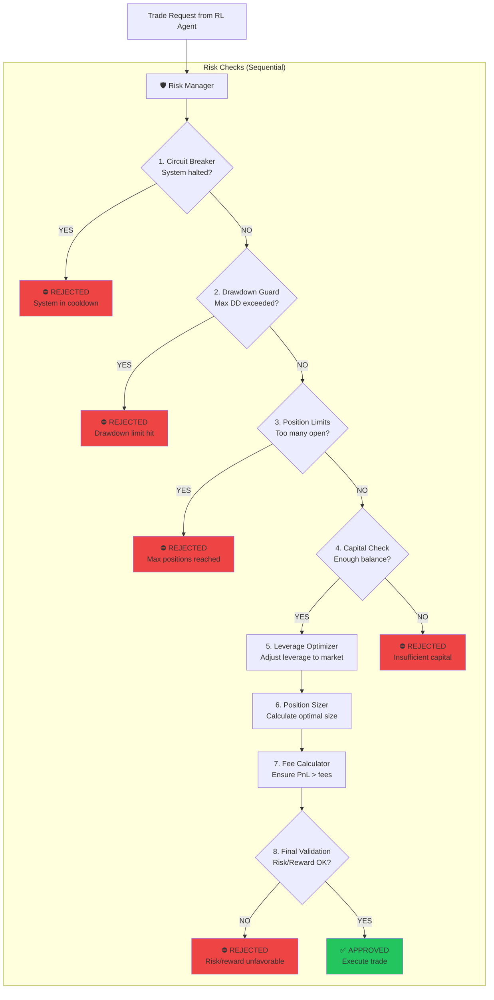
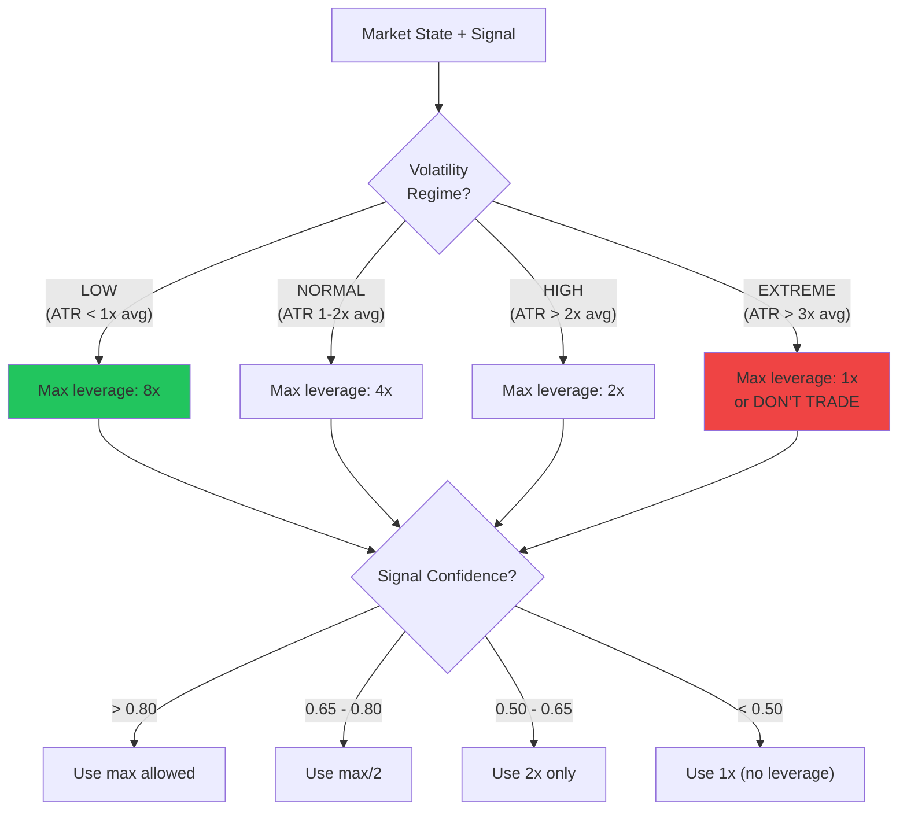
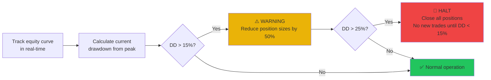
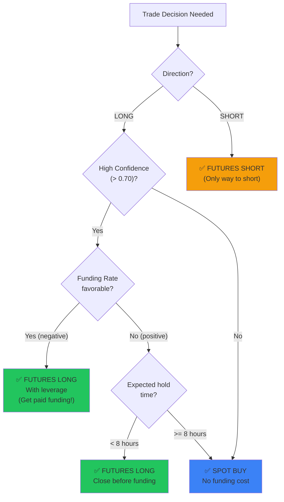

# 🛡️ Module 5: Risk Manager — Detailed Design

> The Risk Manager is the **last line of defense**. It operates independently of all AI models and cannot be overridden. Even the best AI makes mistakes — this module ensures mistakes don't become catastrophes.

---

## Table of Contents

1. [Overview](#overview)
2. [Risk Architecture](#risk-architecture)
3. [Position Sizing (Kelly Criterion)](#position-sizing-kelly-criterion)
4. [Dynamic Leverage Optimizer](#dynamic-leverage-optimizer)
5. [Circuit Breakers](#circuit-breakers)
6. [Drawdown Guard](#drawdown-guard)
7. [Funding Rate Monitor](#funding-rate-monitor)
8. [Instrument Selection Logic](#instrument-selection-logic)
9. [Fee Management](#fee-management)
10. [Configuration](#configuration)

---

## Overview



---

## Risk Architecture

### Core Principles

| # | Principle | Implementation |
|:---|:---|:---|
| 1 | **Never risk more than 5% per trade** | Kelly Criterion capped at 5% of capital |
| 2 | **Hard stop-loss always** | Every position has a stop-loss (default 30%) |
| 3 | **Progressive position sizing** | Size based on confidence × win rate |
| 4 | **Leverage scales with confidence** | High confidence → more leverage |
| 5 | **Auto-pause on consecutive losses** | 3+ consecutive losses → cooldown |
| 6 | **Fees must be covered** | Ensure expected profit > total fees |
| 7 | **Max exposure limit** | Never exceed 80% of total capital in positions |
| 8 | **Independent from AI** | Risk Manager cannot be overridden by any model |

### Class Structure

```python
class RiskManager:
    """
    Independent risk enforcement layer.
    ALL trades must pass through this before execution.
    """

    def __init__(self, config: RiskConfig):
        self.config = config
        self.position_sizer = PositionSizer(config)
        self.leverage_optimizer = LeverageOptimizer(config)
        self.circuit_breaker = CircuitBreaker(config)
        self.drawdown_guard = DrawdownGuard(config)
        self.funding_monitor = FundingRateMonitor(config)
        self.fee_calculator = FeeCalculator(config)

    def validate_trade(self, trade_request: TradeRequest,
                       portfolio: Portfolio,
                       market_state: MarketState) -> TradeDecision:
        """
        Run all risk checks on a proposed trade.
        Returns approved/rejected decision with reasoning.
        """
        checks = []

        # 1. Circuit breaker check
        cb_result = self.circuit_breaker.check(portfolio)
        checks.append(cb_result)
        if not cb_result.passed:
            return TradeDecision(approved=False, reason=cb_result.reason, checks=checks)

        # 2. Drawdown guard
        dd_result = self.drawdown_guard.check(portfolio)
        checks.append(dd_result)
        if not dd_result.passed:
            return TradeDecision(approved=False, reason=dd_result.reason, checks=checks)

        # 3. Position limits
        if len(portfolio.open_positions) >= self.config.max_positions:
            return TradeDecision(approved=False,
                                reason=f"Max positions ({self.config.max_positions}) reached",
                                checks=checks)

        # 4. Capital check
        min_required = max(self.config.min_trade_size, trade_request.size)
        if portfolio.available_balance < min_required:
            return TradeDecision(approved=False,
                                reason=f"Insufficient capital: ₹{portfolio.available_balance:.2f}",
                                checks=checks)

        # 5. Optimize leverage
        optimal_leverage = self.leverage_optimizer.get_optimal(
            market_state, trade_request.confidence
        )

        # 6. Calculate position size
        position_size = self.position_sizer.calculate(
            portfolio, trade_request.confidence, market_state
        )

        # 7. Fee check
        fees = self.fee_calculator.estimate(position_size, optimal_leverage)
        expected_profit = position_size * trade_request.expected_move_pct
        if expected_profit < fees * 2:  # Need at least 2x fees in expected profit
            return TradeDecision(approved=False,
                                reason=f"Expected profit (₹{expected_profit:.2f}) < 2x fees (₹{fees*2:.2f})",
                                checks=checks)

        # 8. All checks passed
        return TradeDecision(
            approved=True,
            adjusted_size=position_size,
            adjusted_leverage=optimal_leverage,
            stop_loss_price=self._calc_stop_loss(trade_request, market_state),
            take_profit_price=self._calc_take_profit(trade_request, market_state),
            estimated_fees=fees,
            risk_reward_ratio=trade_request.expected_move_pct / self.config.stop_loss_pct,
            checks=checks
        )
```

---

## Position Sizing (Kelly Criterion)

### Formula

```
Kelly % = W - [(1 - W) / R]

Where:
  W = Win rate (from recent trades)
  R = Win/Loss ratio (avg win / avg loss)
```

### Implementation

```python
class PositionSizer:
    """
    Calculates optimal position size using a modified Kelly Criterion.
    """

    def __init__(self, config):
        self.max_position_pct = config.get('max_position_pct', 0.05)  # Max 5% per trade
        self.min_trade_size = config.get('min_trade_size', 100)        # ₹100 minimum
        self.kelly_fraction = config.get('kelly_fraction', 0.5)        # Half-Kelly (safer)

    def calculate(self, portfolio: Portfolio, confidence: float,
                  market_state: MarketState) -> float:
        """
        Calculate optimal position size in INR.
        """
        available = portfolio.available_balance

        # 1. Calculate Kelly percentage
        win_rate = portfolio.rolling_win_rate(n=20)  # Last 20 trades
        avg_win = portfolio.avg_win_amount(n=20)
        avg_loss = portfolio.avg_loss_amount(n=20)

        if avg_loss == 0:
            kelly_pct = self.max_position_pct
        else:
            win_loss_ratio = avg_win / avg_loss
            kelly_pct = win_rate - ((1 - win_rate) / win_loss_ratio)

        # 2. Apply half-Kelly (more conservative)
        kelly_pct = max(0, kelly_pct * self.kelly_fraction)

        # 3. Scale by ML confidence
        kelly_pct *= confidence  # Higher confidence → larger position

        # 4. Cap at maximum
        kelly_pct = min(kelly_pct, self.max_position_pct)

        # 5. Calculate INR amount
        position_size = available * kelly_pct

        # 6. Enforce minimum trade size
        if position_size < self.min_trade_size:
            if available >= self.min_trade_size:
                position_size = self.min_trade_size
            else:
                position_size = 0  # Can't trade

        return round(position_size, 2)
```

### Position Sizing Example

```
Portfolio: ₹2,000
Win Rate (last 20 trades): 55%
Avg Win: ₹150
Avg Loss: ₹100
Win/Loss Ratio: 1.5

Kelly % = 0.55 - (0.45 / 1.5) = 0.55 - 0.30 = 0.25 (25%)
Half-Kelly = 0.25 × 0.50 = 0.125 (12.5%)
Scaled by confidence (0.70) = 0.125 × 0.70 = 0.0875 (8.75%)
Capped at max (5%) = 5%

Position Size = ₹2,000 × 5% = ₹100
With 8x leverage → ₹800 effective exposure
```

---

## Dynamic Leverage Optimizer

### Leverage Selection Logic



```python
class LeverageOptimizer:
    """
    Dynamically selects leverage based on market volatility and signal confidence.
    """

    # Volatility regime → max allowed leverage
    REGIME_MAP = {
        'LOW':     8,     # ATR < 1×avg → can go up to 8x
        'NORMAL':  4,     # ATR 1-2×avg → max 4x
        'HIGH':    2,     # ATR > 2×avg → max 2x
        'EXTREME': 1,     # ATR > 3×avg → no leverage
    }

    def get_optimal(self, market_state: MarketState, confidence: float) -> int:
        # 1. Determine volatility regime
        regime = self._classify_volatility(market_state)
        max_leverage = self.REGIME_MAP[regime]

        # 2. Scale by confidence
        if confidence > 0.80:
            leverage = max_leverage
        elif confidence > 0.65:
            leverage = max(1, max_leverage // 2)
        elif confidence > 0.50:
            leverage = 2
        else:
            leverage = 1

        # 3. Snap to CoinSwitch supported levels
        supported = [1, 2, 4, 8, 10, 15, 20, 25, 50]
        leverage = max(l for l in supported if l <= leverage)

        return leverage

    def _classify_volatility(self, market_state):
        atr_ratio = market_state.current_atr / market_state.avg_atr_20
        if atr_ratio < 1.0:
            return 'LOW'
        elif atr_ratio < 2.0:
            return 'NORMAL'
        elif atr_ratio < 3.0:
            return 'HIGH'
        else:
            return 'EXTREME'
```

---

## Circuit Breakers

### Trigger Conditions

| Trigger | Threshold | Action | Cooldown |
|:---|:---|:---|:---|
| Consecutive losses | ≥ 3 losses in a row | Pause all trading | 1 hour |
| Rapid loss | > 10% capital lost in 1 hour | Emergency halt | 4 hours |
| Extreme volatility | ATR > 5× average | Pause new positions | Until ATR normalizes |
| API errors | > 5 failed API calls | Pause execution | 15 minutes |
| Data staleness | No data update > 5 min | Alert + pause | Until data resumes |
| Flash crash | Price drop > 15% in 5 min | Close all positions | 2 hours |

```python
class CircuitBreaker:
    """
    Emergency stop mechanism that halts trading under dangerous conditions.
    """

    def __init__(self, config):
        self.max_consecutive_losses = config.get('max_consecutive_losses', 3)
        self.max_hourly_loss_pct = config.get('max_hourly_loss_pct', 0.10)
        self.max_atr_multiplier = config.get('max_atr_multiplier', 5.0)
        self.flash_crash_threshold = config.get('flash_crash_threshold', 0.15)

        self.is_halted = False
        self.halt_until = None
        self.halt_reason = None

    def check(self, portfolio: Portfolio) -> CheckResult:
        # Check if currently halted
        if self.is_halted:
            if datetime.now() < self.halt_until:
                return CheckResult(
                    passed=False,
                    reason=f"Trading halted until {self.halt_until}. Reason: {self.halt_reason}"
                )
            else:
                self.is_halted = False  # Cooldown expired

        # Check consecutive losses
        if portfolio.consecutive_losses >= self.max_consecutive_losses:
            self._halt(duration_hours=1,
                       reason=f"{portfolio.consecutive_losses} consecutive losses")
            return CheckResult(passed=False, reason=self.halt_reason)

        # Check hourly loss
        hourly_pnl = portfolio.get_pnl_last_hours(1)
        if hourly_pnl < -self.max_hourly_loss_pct * portfolio.initial_balance:
            self._halt(duration_hours=4,
                       reason=f"Lost {abs(hourly_pnl):.0f} INR in last hour")
            return CheckResult(passed=False, reason=self.halt_reason)

        return CheckResult(passed=True)

    def _halt(self, duration_hours, reason):
        self.is_halted = True
        self.halt_until = datetime.now() + timedelta(hours=duration_hours)
        self.halt_reason = reason
        logger.critical(f"🚨 CIRCUIT BREAKER: {reason}. Halted until {self.halt_until}")
```

---

## Drawdown Guard

### Maximum Drawdown Protection



```python
class DrawdownGuard:
    """
    Progressive drawdown protection.
    """

    def __init__(self, config):
        self.warning_threshold = config.get('dd_warning', 0.15)   # 15%
        self.critical_threshold = config.get('dd_critical', 0.25)  # 25%
        self.halt_threshold = config.get('dd_halt', 0.30)          # 30%
        self.peak_equity = 0

    def check(self, portfolio: Portfolio) -> CheckResult:
        current_equity = portfolio.total_equity
        self.peak_equity = max(self.peak_equity, current_equity)

        if self.peak_equity == 0:
            return CheckResult(passed=True)

        drawdown = (self.peak_equity - current_equity) / self.peak_equity

        if drawdown >= self.halt_threshold:
            return CheckResult(
                passed=False,
                reason=f"CRITICAL: Drawdown {drawdown:.1%} exceeds {self.halt_threshold:.0%} limit",
                action="HALT"
            )

        if drawdown >= self.critical_threshold:
            return CheckResult(
                passed=True,
                reason=f"WARNING: Drawdown {drawdown:.1%} - reducing position sizes",
                action="REDUCE_SIZE",
                size_multiplier=0.25  # Only 25% of normal size
            )

        if drawdown >= self.warning_threshold:
            return CheckResult(
                passed=True,
                reason=f"CAUTION: Drawdown {drawdown:.1%} - position sizes halved",
                action="REDUCE_SIZE",
                size_multiplier=0.50  # Only 50% of normal size
            )

        return CheckResult(passed=True)
```

---

## Funding Rate Monitor

### Why Monitor Funding Rates?

In perpetual futures, a **funding rate** is paid between longs and shorts every 8 hours:

- **Positive funding** → Longs pay shorts (many longs, market overheated)
- **Negative funding** → Shorts pay longs (many shorts, market oversold)

```python
class FundingRateMonitor:
    """
    Monitors futures funding rates to:
    1. Avoid paying excessive funding fees
    2. Identify contrarian opportunities
    """

    def analyze(self, pair: str, funding_rate: float) -> FundingAnalysis:
        if abs(funding_rate) < 0.0001:  # < 0.01%
            return FundingAnalysis(
                severity='NEUTRAL',
                message='Funding rate near zero - no impact',
                recommendation='PROCEED'
            )

        if funding_rate > 0.001:  # > 0.1% (longs pay)
            return FundingAnalysis(
                severity='WARNING',
                message=f'High positive funding ({funding_rate:.4%}) - expensive to hold longs',
                recommendation='PREFER_SHORT_OR_SPOT',
                estimated_8h_cost=funding_rate  # Cost per 8h
            )

        if funding_rate < -0.001:  # < -0.1% (shorts pay)
            return FundingAnalysis(
                severity='OPPORTUNITY',
                message=f'Negative funding ({funding_rate:.4%}) - longs get paid!',
                recommendation='PREFER_LONG_FUTURES',
                estimated_8h_income=abs(funding_rate)
            )
```

---

## Instrument Selection Logic

### When to Use Spot vs Futures



### Decision Matrix

| Scenario | Signal | Confidence | Funding | Volatility | → Instrument | → Leverage |
|:---|:---|:---|:---|:---|:---|:---|
| Strong bull, low vol | UP | 0.85 | Negative | Low | FUTURES LONG | 8x |
| Moderate bull | UP | 0.65 | Positive | Normal | SPOT BUY | 1x |
| Strong bear | DOWN | 0.80 | Positive | Low | FUTURES SHORT | 4x |
| High vol, bull | UP | 0.75 | Neutral | High | FUTURES LONG | 2x |
| Extreme vol | UP | 0.60 | Any | Extreme | SPOT BUY | 1x |
| Low confidence | UP | 0.55 | Any | Any | SPOT BUY | 1x |
| Sideways market | FLAT | Any | Any | Low | NO TRADE | — |

---

## Fee Management

### CoinSwitch Fee Structure

| Fee Type | Spot | Futures |
|:---|:---|:---|
| Maker Fee | 0.10% | 0.02% |
| Taker Fee | 0.10% | 0.05% |
| Funding Fee | N/A | Variable (every 8h) |
| Withdrawal Fee | Per coin | N/A |

### Fee-Aware Trading

```python
class FeeCalculator:
    """
    Calculates total fees for a trade and ensures profitability after fees.
    """

    def estimate_roundtrip_fees(self, position_size: float,
                                 leverage: float,
                                 instrument: str) -> dict:
        """
        Calculate total fees for opening AND closing a position.
        """
        effective_size = position_size * leverage

        if instrument == 'SPOT':
            entry_fee = effective_size * 0.001  # 0.1% taker
            exit_fee = effective_size * 0.001    # 0.1% taker
            funding_fee = 0
        else:  # FUTURES
            entry_fee = effective_size * 0.0005  # 0.05% taker
            exit_fee = effective_size * 0.0005   # 0.05% taker
            # Estimate 1 funding period
            funding_fee = effective_size * 0.0001  # ~0.01% avg

        total_fees = entry_fee + exit_fee + funding_fee

        return {
            'entry_fee': entry_fee,
            'exit_fee': exit_fee,
            'funding_fee': funding_fee,
            'total_fees': total_fees,
            'breakeven_move_pct': total_fees / effective_size * 100,
            'fees_as_pct_of_capital': total_fees / position_size * 100
        }
```

### Fee Impact Example

```
Position: ₹100 × 8x leverage = ₹800 effective

Futures fees:
  Entry:   ₹800 × 0.05% = ₹0.40
  Exit:    ₹800 × 0.05% = ₹0.40
  Funding: ₹800 × 0.01% = ₹0.08
  Total:   ₹0.88

Breakeven: Need 0.11% price move just to cover fees
Target (10%): ₹800 × 10% = ₹80 profit
Fee impact: ₹0.88 / ₹80 = 1.1% of profit (negligible ✅)
```

---

## Configuration

```yaml
# trading_config.yaml - Risk section

risk:
  # Position sizing
  max_position_pct: 0.05          # Max 5% of capital per trade
  min_trade_size: 100             # Minimum ₹100
  kelly_fraction: 0.50            # Half-Kelly (conservative)
  max_total_exposure: 0.80        # Max 80% of capital in positions
  max_positions: 3                # Max concurrent positions

  # Stop loss / Take profit
  default_stop_loss: 0.30         # 30% stop loss
  default_take_profit: 0.10       # 10% take profit
  trailing_stop: true             # Enable trailing stop
  trailing_stop_distance: 0.05   # 5% trailing distance

  # Circuit breakers
  max_consecutive_losses: 3       # Halt after 3 losses
  max_hourly_loss_pct: 0.10      # Halt if 10% lost in 1 hour
  max_daily_loss_pct: 0.20       # Halt if 20% lost in 1 day
  flash_crash_threshold: 0.15    # 15% drop in 5 min = flash crash

  # Drawdown
  dd_warning: 0.15               # 15% DD → reduce to 50% size
  dd_critical: 0.25              # 25% DD → reduce to 25% size
  dd_halt: 0.30                  # 30% DD → halt all trading

  # Leverage
  max_leverage: 8                # Default max leverage
  leverage_volatility_scaling: true  # Auto-reduce in high vol

  # Fees
  spot_maker_fee: 0.001          # 0.1%
  spot_taker_fee: 0.001          # 0.1%
  futures_maker_fee: 0.0002      # 0.02%
  futures_taker_fee: 0.0005      # 0.05%
  min_profit_fee_ratio: 2.0      # Expected profit must be 2x fees
```

### API Endpoints (Risk Manager)

| Endpoint | Method | Purpose |
|:---|:---|:---|
| `/api/risk/status` | GET | Current risk state (halted, drawdown, etc.) |
| `/api/risk/validate` | POST | Validate a proposed trade |
| `/api/risk/circuit-breaker` | GET | Circuit breaker status |
| `/api/risk/override` | POST | Manual override (emergency only) |
| `/api/risk/config` | GET/PUT | View/update risk parameters |
| `/api/risk/history` | GET | Risk events log |

