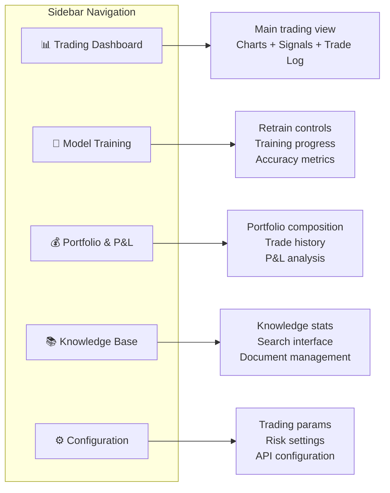
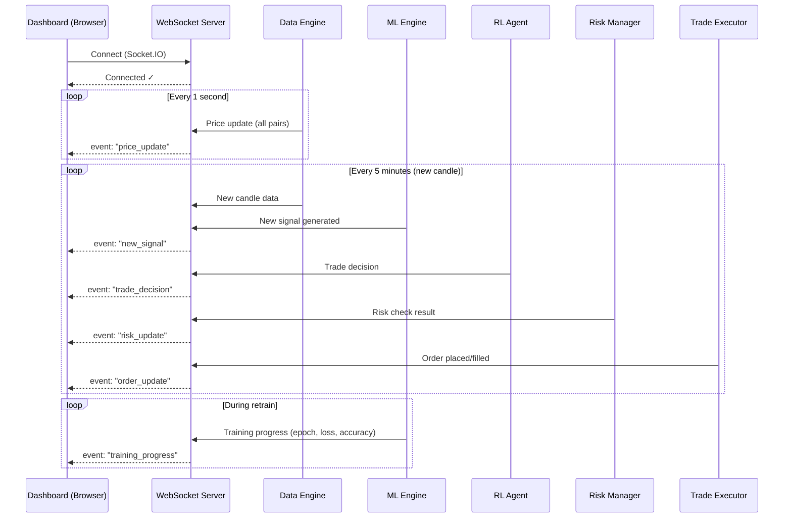

# 📊 Module 6: Dashboard UI — Detailed Design

> The command center. Everything the system does is streamed here in real-time. You watch, the AI trades.

---

## Table of Contents

1. [Overview](#overview)
2. [UI Layout & Pages](#ui-layout--pages)
3. [Real-Time Streaming Architecture](#real-time-streaming-architecture)
4. [Page 1: Trading Dashboard](#page-1-trading-dashboard)
5. [Page 2: Model Training & Retrain](#page-2-model-training--retrain)
6. [Page 3: Portfolio & P&L](#page-3-portfolio--pl)
7. [Page 4: Knowledge Base](#page-4-knowledge-base)
8. [Page 5: System Configuration](#page-5-system-configuration)
9. [Chart Specifications](#chart-specifications)
10. [WebSocket Events](#websocket-events)
11. [Technology Stack](#technology-stack)

---

## Overview

The dashboard is a **premium, dark-themed** web application that:

- 📈 Shows real-time price charts with indicator overlays
- 🔄 Streams live trade executions and reasoning
- 📊 Displays model performance and accuracy metrics
- 🔮 Shows current ML signals with confidence levels
- 🛡️ Displays risk status and circuit breaker state
- 🔧 Provides one-click retrain with live training visualization
- ⚙️ Allows configuration of all trading parameters

---

## UI Layout & Pages

### Navigation Structure



### Design System

| Element | Specification |
|:---|:---|
| **Theme** | Dark mode (primary: #0a0a0f, surface: #1a1a2e) |
| **Accent** | Electric blue (#3b82f6) + Emerald green (#10b981) |
| **Font** | Inter (headings), JetBrains Mono (data/numbers) |
| **Cards** | Glassmorphism with subtle borders |
| **Animations** | Framer Motion for transitions, smooth chart updates |
| **Grid** | 12-column responsive grid |
| **Charts** | TradingView Lightweight Charts + Recharts |

---

## Real-Time Streaming Architecture

### WebSocket Flow



### Backend WebSocket Server

```python
from fastapi import FastAPI
from fastapi.middleware.cors import CORSMiddleware
import socketio

# Socket.IO server
sio = socketio.AsyncServer(
    async_mode='asgi',
    cors_allowed_origins="*"
)
app = FastAPI()
socket_app = socketio.ASGIApp(sio, app)

@sio.event
async def connect(sid, environ):
    print(f"Client connected: {sid}")
    # Send current state snapshot
    await sio.emit('state_snapshot', get_current_state(), to=sid)

# Emit events from various modules
async def emit_price_update(pair: str, price_data: dict):
    await sio.emit('price_update', {
        'pair': pair,
        'price': price_data['close'],
        'change_24h': price_data['change_pct'],
        'volume': price_data['volume'],
        'timestamp': price_data['timestamp']
    })

async def emit_signal(signal: TradingSignal):
    await sio.emit('new_signal', signal.to_dict())

async def emit_trade(trade: Trade):
    await sio.emit('trade_update', {
        'id': trade.id,
        'pair': trade.pair,
        'side': trade.side,
        'instrument': trade.instrument,
        'leverage': trade.leverage,
        'size': trade.size,
        'entry_price': trade.entry_price,
        'status': trade.status,
        'pnl': trade.pnl,
        'reason': trade.reasoning  # Why this trade was made
    })

async def emit_training_progress(progress: dict):
    await sio.emit('training_progress', progress)
```

---

## Page 1: Trading Dashboard

### Layout

```
┌──────────────────────────────────────────────────────────────────────────────┐
│  🔵 CryptoAgent                   │ BTC ₹56,23,400 (+2.3%) │ ⚡ LIVE       │
├───────────┬──────────────────────────────────────────────────────────────────┤
│           │                                                                  │
│  📊 Dash  │  ┌─── Price Chart (TradingView) ────────────────────────────┐   │
│  🧠 Train │  │                                                          │   │
│  💰 P&L   │  │   [Full-width candlestick chart with indicators]         │   │
│  📚 Know  │  │   [RSI overlay, MACD below, Volume bars]                 │   │
│  ⚙️ Config │  │   [ML signal markers: ▲ BUY  ▼ SELL]                   │   │
│           │  │   [Entry/exit points highlighted]                        │   │
│           │  │                                                          │   │
│           │  └──────────────────────────────────────────────────────────┘   │
│           │                                                                  │
│           │  ┌─── Active Signals ─────────┬─── Risk Status ──────────┐     │
│           │  │                             │                          │     │
│           │  │  BTC-INR  ▲ UP  (0.78)     │  ⚡ Status: ACTIVE       │     │
│           │  │  ETH-INR  ▼ DOWN (0.65)    │  📉 Drawdown: 3.2%      │     │
│           │  │  SOL-INR  ─ FLAT (0.52)    │  🏦 Exposure: 42%       │     │
│           │  │  BNB-INR  ▲ UP  (0.71)     │  🛡️ Circuit: NORMAL     │     │
│           │  │                             │  💰 Available: ₹1,180   │     │
│           │  └─────────────────────────────┴──────────────────────────┘     │
│           │                                                                  │
│           │  ┌─── Trade Log (Real-time) ──────────────────────────────┐     │
│           │  │                                                        │     │
│           │  │  Time    Pair     Side   Lev  Size   P&L    Status    │     │
│           │  │  ────    ────     ────   ───  ────   ───    ──────    │     │
│           │  │  08:15   BTC-INR  LONG   8x   ₹100  +₹82   ✅ CLOSED │     │
│           │  │  07:30   ETH-INR  SHORT  4x   ₹150  -₹23   ❌ CLOSED │     │
│           │  │  06:45   SOL-INR  LONG   8x   ₹100  +₹15   📊 OPEN  │     │
│           │  │                                                        │     │
│           │  │  [Why this trade?] → "ML signal: UP (0.82), 3 models  │     │
│           │  │   agree, Knowledge: Bollinger squeeze breakout pattern,│     │
│           │  │   RL confidence: 0.91, Leverage: 8x (low vol regime)" │     │
│           │  │                                                        │     │
│           │  └────────────────────────────────────────────────────────┘     │
│           │                                                                  │
└───────────┴──────────────────────────────────────────────────────────────────┘
```

### Key Components

#### Price Chart
- **Library:** TradingView Lightweight Charts
- **Features:**
  - Candlestick chart (default 5m candles)
  - Timeframe selector: 1m, 5m, 15m, 1h, 4h, 1d
  - Indicator overlays (SMA, EMA, Bollinger Bands)
  - Sub-charts: RSI, MACD, Volume
  - ML signal markers (▲/▼ on chart at signal timestamps)
  - Trade entry/exit markers with P&L labels

#### Signal Panel
- Real-time signals for all tracked pairs
- Color-coded: Green (UP), Red (DOWN), Gray (FLAT)
- Confidence bars showing 3-model agreement
- Tooltip showing individual model predictions

#### Risk Status Widget
- Traffic-light system: 🟢 Normal / 🟡 Caution / 🔴 Halted
- Live drawdown percentage with visual bar
- Capital exposure gauge
- Circuit breaker countdown (if active)

#### Trade Log
- Live updating table of all trades
- Expandable rows showing AI reasoning
- Color-coded P&L
- Filter by pair, status, instrument

---

## Page 2: Model Training & Retrain

### Layout

```
┌──────────────────────────────────────────────────────────────────────────────┐
│  🧠 Model Training & Retrain                                               │
├──────────────────────────────────────────────────────────────────────────────┤
│                                                                              │
│  ┌─── Retrain Controls ──────────────────────────────────────────────┐      │
│  │                                                                    │      │
│  │  📅 Training Period: [Last 90 days ▼]  Test Period: [Last 15 days]│      │
│  │  🎯 Pairs: [Auto (Top by Volume) ▼]    Models: [✅ All ▼]        │      │
│  │                                                                    │      │
│  │  ┌─────────────────────────────────────────────────────────┐      │      │
│  │  │          🔄  START RETRAIN          │     ⏹️ CANCEL     │      │      │
│  │  └─────────────────────────────────────────────────────────┘      │      │
│  └────────────────────────────────────────────────────────────────────┘      │
│                                                                              │
│  ┌─── Training Progress ─────────────────────────────────────────────┐      │
│  │                                                                    │      │
│  │  📡 Data Sync ...................... ✅ 15,420 rows fetched        │      │
│  │  ⚙️  Feature Engineering .......... ✅ 80 features computed       │      │
│  │  📊 Walk-Forward Split ............ ✅ 4 windows created          │      │
│  │                                                                    │      │
│  │  🔮 LSTM Training ................. ██████████████░░ 78%          │      │
│  │     Epoch 39/50 | Loss: 0.682 | Val Acc: 61.2%                   │      │
│  │                                                                    │      │
│  │  🌲 XGBoost ....................... ⏳ Pending                     │      │
│  │  ⚡ Transformer ................... ⏳ Pending                     │      │
│  │  🎯 Ensemble ...................... ⏳ Pending                     │      │
│  └────────────────────────────────────────────────────────────────────┘      │
│                                                                              │
│  ┌─── Live Training Charts ──────────────────────────────────────────┐      │
│  │                                                                    │      │
│  │  [Loss Curve Chart]                [Accuracy Curve Chart]          │      │
│  │  Training Loss ─── Val Loss        Training Acc ─── Val Acc       │      │
│  │                                                                    │      │
│  └────────────────────────────────────────────────────────────────────┘      │
│                                                                              │
│  ┌─── Model Performance Table ───────────────────────────────────────┐      │
│  │                                                                    │      │
│  │  Model       Accuracy  Precision  Recall  F1    Sharpe  WinRate  │      │
│  │  ──────      ────────  ─────────  ──────  ──    ──────  ───────  │      │
│  │  LSTM        62.3%     63.1%      61.8%   62.4  1.21    57.3%   │      │
│  │  XGBoost     64.1%     65.0%      63.5%   64.2  1.35    59.1%   │      │
│  │  Transformer 61.8%     62.5%      61.2%   61.8  1.15    56.8%   │      │
│  │  Ensemble    66.7%     67.2%      66.0%   66.6  1.52    61.4%   │      │
│  │                                                                    │      │
│  └────────────────────────────────────────────────────────────────────┘      │
│                                                                              │
│  ┌─── Confusion Matrix ──────────┬─── Feature Importance ────────────┐      │
│  │                                │                                   │      │
│  │  [Interactive heatmap]         │  1. RSI_14          ████████ 12% │      │
│  │                                │  2. MACD_signal     ███████  10% │      │
│  │  Pred→  DOWN  FLAT   UP       │  3. BB_position     ██████    9% │      │
│  │  DOWN  [ 142   38    20 ]     │  4. Volume_ratio    █████     8% │      │
│  │  FLAT  [  35  180    35 ]     │  5. ATR_14          █████     7% │      │
│  │  UP    [  18   40   148 ]     │  6. EMA_cross       ████      6% │      │
│  │                                │  7. Funding_rate    ████      5% │      │
│  │                                │  8. FearGreed       ███       4% │      │
│  └────────────────────────────────┴───────────────────────────────────┘      │
│                                                                              │
│  ┌─── Retrain History ───────────────────────────────────────────────┐      │
│  │                                                                    │      │
│  │  Date         Duration   Accuracy   Sharpe   Status               │      │
│  │  Apr 11 08:00  12m 34s   66.7%      1.52     ✅ Deployed          │      │
│  │  Apr 04 08:00  11m 22s   64.2%      1.38     📦 Archived          │      │
│  │  Mar 28 08:00  13m 01s   63.8%      1.29     📦 Archived          │      │
│  └────────────────────────────────────────────────────────────────────┘      │
│                                                                              │
└──────────────────────────────────────────────────────────────────────────────┘
```

---

## Page 3: Portfolio & P&L

### Layout

```
┌──────────────────────────────────────────────────────────────────────────────┐
│  💰 Portfolio & P&L                                                         │
├──────────────────────────────────────────────────────────────────────────────┤
│                                                                              │
│  ┌─── Portfolio Summary ─────────────────────────────────────────────┐      │
│  │                                                                    │      │
│  │  💰 Balance: ₹2,340    📈 Total P&L: +₹340 (+17.0%)             │      │
│  │  📊 Open Positions: 2   🏆 Win Rate: 61.4%                       │      │
│  │  📉 Max Drawdown: 8.2%  ⚡ Sharpe Ratio: 1.52                   │      │
│  │                                                                    │      │
│  └────────────────────────────────────────────────────────────────────┘      │
│                                                                              │
│  ┌─── Equity Curve ─────────────────────────────────────────────────┐      │
│  │                                                                    │      │
│  │  [Line chart showing equity over time]                             │      │
│  │  [With drawdown overlay shaded in red]                             │      │
│  │  [Benchmark: Buy & Hold BTC shown as comparison]                   │      │
│  │                                                                    │      │
│  └────────────────────────────────────────────────────────────────────┘      │
│                                                                              │
│  ┌─── Daily P&L ──────────────────┬─── Pair Breakdown ───────────────┐      │
│  │                                │                                   │      │
│  │  [Bar chart: daily P&L]        │  BTC-INR: +₹180 (53%)           │      │
│  │  [Green bars = profit]         │  ETH-INR: +₹90  (26%)           │      │
│  │  [Red bars = loss]             │  SOL-INR: +₹50  (15%)           │      │
│  │                                │  DOGE-INR: +₹20 (6%)            │      │
│  │                                │                                   │      │
│  └────────────────────────────────┴───────────────────────────────────┘      │
│                                                                              │
│  ┌─── Complete Trade History ────────────────────────────────────────┐      │
│  │                                                                    │      │
│  │  [Filterable, sortable table]                                      │      │
│  │  [Export to CSV button]                                            │      │
│  │  [Pagination: 20 per page]                                        │      │
│  │                                                                    │      │
│  │  #   Date       Pair     Side    Inst  Lev  Entry    Exit    P&L  │      │
│  │  --  ----       ----     ----    ----  ---  -----    ----    ---  │      │
│  │  47  Apr 11     BTC-INR  LONG    FUT   8x   56.2L   60.8L  +₹82 │      │
│  │  46  Apr 11     ETH-INR  SHORT   FUT   4x   3.1L    2.9L   +₹32 │      │
│  │  45  Apr 10     SOL-INR  LONG    SPOT  1x   12.4K   13.1K  +₹15 │      │
│  │  ...                                                               │      │
│  └────────────────────────────────────────────────────────────────────┘      │
│                                                                              │
└──────────────────────────────────────────────────────────────────────────────┘
```

---

## Page 4: Knowledge Base

### Layout

```
┌──────────────────────────────────────────────────────────────────────────────┐
│  📚 Knowledge Base                                                          │
├──────────────────────────────────────────────────────────────────────────────┤
│                                                                              │
│  ┌─── Knowledge Stats ──────────────────────────────────────────────┐      │
│  │                                                                    │      │
│  │  📄 Documents: 15     📝 Chunks: 2,340    🔢 Embeddings: 2,340   │      │
│  │  📁 Collections: 4    💾 Size: 45 MB      🔄 Last Updated: 2h ago│      │
│  │                                                                    │      │
│  └────────────────────────────────────────────────────────────────────┘      │
│                                                                              │
│  ┌─── Search Interface ─────────────────────────────────────────────┐      │
│  │                                                                    │      │
│  │  🔍 [Search knowledge base...                         ] [Search]  │      │
│  │                                                                    │      │
│  │  Results for "mean reversion crypto":                              │      │
│  │                                                                    │      │
│  │  📄 "Mean Reversion Strategies in Crypto Markets"                 │      │
│  │     Source: crypto_trading_guide.pdf, p.45                        │      │
│  │     Relevance: 0.92                                                │      │
│  │     "In highly volatile crypto markets, mean reversion works      │      │
│  │     best in ranging conditions identified by ADX < 20..."         │      │
│  │                                                                    │      │
│  │  📄 "Bollinger Band Squeeze for Crypto"                           │      │
│  │     Source: technical_analysis.pdf, p.112                         │      │
│  │     Relevance: 0.87                                                │      │
│  │     "When Bollinger Bands narrow significantly, expect..."         │      │
│  │                                                                    │      │
│  └────────────────────────────────────────────────────────────────────┘      │
│                                                                              │
│  ┌─── Document Manager ─────────────────────────────────────────────┐      │
│  │                                                                    │      │
│  │  [📤 Upload New Document]  [🔄 Re-index All]                     │      │
│  │                                                                    │      │
│  │  Document                  Chunks  Collection     Status          │      │
│  │  ──────────                ──────  ──────────     ──────          │      │
│  │  crypto_strategies.pdf     420     strategies     ✅ Indexed      │      │
│  │  risk_management.pdf       280     risk           ✅ Indexed      │      │
│  │  ta_handbook.pdf           680     patterns       ✅ Indexed      │      │
│  │  defi_guide.epub           340     crypto         ✅ Indexed      │      │
│  │                                                                    │      │
│  └────────────────────────────────────────────────────────────────────┘      │
│                                                                              │
└──────────────────────────────────────────────────────────────────────────────┘
```

---

## Page 5: System Configuration

### Layout

```
┌──────────────────────────────────────────────────────────────────────────────┐
│  ⚙️ System Configuration                                                    │
├──────────────────────────────────────────────────────────────────────────────┤
│                                                                              │
│  ┌─── Trading Parameters ──────────┬─── Risk Parameters ────────────┐      │
│  │                                  │                                 │      │
│  │  Target Profit:  [ 10 ]%        │  Max Position %:  [ 5.0 ]%     │      │
│  │  Stop Loss:      [ 30 ]%        │  Min Trade Size:  [ 100 ] ₹    │      │
│  │  Default Leverage: [ 8 ]x       │  Max Positions:   [ 3 ]        │      │
│  │  Max Leverage:   [ 8 ]x         │  Max Exposure:    [ 80 ]%      │      │
│  │  Trading Mode:   [Paper ▼]      │  Max Drawdown:    [ 30 ]%      │      │
│  │                                  │  Consec. Loss Limit: [ 3 ]     │      │
│  │  Pairs: [Auto-select ▼]         │                                 │      │
│  │  Timeframe: [5m ▼]              │  Trailing Stop:   [✅ On]      │      │
│  │                                  │  Trail Distance:  [ 5.0 ]%     │      │
│  └──────────────────────────────────┴─────────────────────────────────┘      │
│                                                                              │
│  ┌─── API Configuration ──────────┬─── ML Configuration ─────────────┐     │
│  │                                 │                                   │     │
│  │  CoinSwitch API Key: [****]    │  LSTM Epochs:     [ 50 ]         │     │
│  │  CoinSwitch Secret:  [****]    │  XGB Estimators:  [ 500 ]        │     │
│  │  LLM Provider: [OpenAI ▼]     │  Transformer Ep.: [ 30 ]         │     │
│  │  LLM API Key:  [****]         │  Sequence Length:  [ 60 ]         │     │
│  │                                 │  Min Accuracy:    [ 55 ]%        │     │
│  │  [🔄 Test Connection]          │  Auto Retrain:    [❌ Off]       │     │
│  │                                 │  Retrain Interval: [168] hrs     │     │
│  │  Status: ✅ Connected          │                                   │     │
│  └─────────────────────────────────┴───────────────────────────────────┘     │
│                                                                              │
│  ┌─── System Health ─────────────────────────────────────────────────┐      │
│  │                                                                    │      │
│  │  🟢 CoinSwitch API     Connected (latency: 45ms)                 │      │
│  │  🟢 Data Engine        Running (last update: 2s ago)              │      │
│  │  🟢 ML Engine          Active (model loaded: v3.2)                │      │
│  │  🟢 RL Agent           Running (PPO mode)                         │      │
│  │  🟢 Knowledge Base     Ready (2,340 chunks indexed)               │      │
│  │  🟢 Risk Manager       Active (no alerts)                         │      │
│  │  🟢 WebSocket          4 active connections                       │      │
│  │                                                                    │      │
│  │  [📋 View Logs]  [🔄 Restart System]  [🛑 Emergency Stop]       │      │
│  └────────────────────────────────────────────────────────────────────┘      │
│                                                                              │
│                              [ 💾 Save Configuration ]                       │
│                                                                              │
└──────────────────────────────────────────────────────────────────────────────┘
```

---

## Chart Specifications

### TradingView Lightweight Charts Integration

```javascript
// Chart configuration for main trading view
import { createChart, ColorType, CrosshairMode } from 'lightweight-charts';

const chartOptions = {
    layout: {
        background: { type: ColorType.Solid, color: '#0a0a0f' },
        textColor: '#d1d4dc',
        fontSize: 12,
        fontFamily: 'Inter, sans-serif',
    },
    grid: {
        vertLines: { color: 'rgba(42, 46, 57, 0.5)' },
        horzLines: { color: 'rgba(42, 46, 57, 0.3)' },
    },
    crosshair: {
        mode: CrosshairMode.Normal,
        vertLine: {
            color: '#3b82f6',
            width: 1,
            style: 2,
        },
        horzLine: {
            color: '#3b82f6',
            width: 1,
            style: 2,
        },
    },
    rightPriceScale: {
        borderColor: 'rgba(197, 203, 206, 0.3)',
    },
    timeScale: {
        borderColor: 'rgba(197, 203, 206, 0.3)',
        timeVisible: true,
    },
};

// Candlestick series
const candleSeries = chart.addCandlestickSeries({
    upColor: '#10b981',
    downColor: '#ef4444',
    borderDownColor: '#ef4444',
    borderUpColor: '#10b981',
    wickDownColor: '#ef4444',
    wickUpColor: '#10b981',
});

// Signal markers
candleSeries.setMarkers([
    {
        time: '2026-04-11',
        position: 'belowBar',
        color: '#10b981',
        shape: 'arrowUp',
        text: 'BUY (0.82)',
    },
    {
        time: '2026-04-10',
        position: 'aboveBar',
        color: '#ef4444',
        shape: 'arrowDown',
        text: 'SELL (0.71)',
    },
]);
```

### Recharts for Analytics

```javascript
// Equity curve chart
<ResponsiveContainer width="100%" height={300}>
    <AreaChart data={equityCurve}>
        <defs>
            <linearGradient id="equityGradient" x1="0" y1="0" x2="0" y2="1">
                <stop offset="5%" stopColor="#10b981" stopOpacity={0.3} />
                <stop offset="95%" stopColor="#10b981" stopOpacity={0} />
            </linearGradient>
        </defs>
        <CartesianGrid strokeDasharray="3 3" stroke="#1a1a2e" />
        <XAxis dataKey="date" stroke="#6b7280" />
        <YAxis stroke="#6b7280" />
        <Tooltip
            contentStyle={{ background: '#1a1a2e', border: '1px solid #3b82f6' }}
        />
        <Area
            type="monotone"
            dataKey="equity"
            stroke="#10b981"
            fill="url(#equityGradient)"
        />
    </AreaChart>
</ResponsiveContainer>
```

---

## WebSocket Events

### Event Catalog

| Event | Direction | Frequency | Payload |
|:---|:---|:---|:---|
| `price_update` | Server → Client | 1/sec | `{pair, price, change_24h, volume}` |
| `new_candle` | Server → Client | Per candle (5m) | `{pair, open, high, low, close, volume}` |
| `new_signal` | Server → Client | Per candle | `{pair, direction, confidence, models}` |
| `trade_decision` | Server → Client | On trade | `{pair, action, size, leverage, reasoning}` |
| `order_update` | Server → Client | On fill | `{order_id, status, filled_price, pnl}` |
| `risk_update` | Server → Client | On change | `{status, drawdown, exposure, alerts}` |
| `training_progress` | Server → Client | During train | `{model, epoch, loss, accuracy, pct}` |
| `system_health` | Server → Client | 30/sec | `{services_status, latencies}` |
| `portfolio_update` | Server → Client | On change | `{balance, equity, positions, pnl}` |

---

## Technology Stack

| Component | Technology | Justification |
|:---|:---|:---|
| **Framework** | Next.js 14 (App Router) | SSR + Client Components |
| **Styling** | Vanilla CSS + CSS Modules | Full control, dark theme |
| **Charts (Trading)** | TradingView Lightweight Charts | Industry standard, free |
| **Charts (Analytics)** | Recharts | React-native, declarative |
| **Real-time** | Socket.IO (client) | WebSocket with fallback |
| **State** | React Context + useReducer | Simple, no dependencies |
| **Icons** | Lucide React | Clean, consistent icons |
| **Fonts** | Inter + JetBrains Mono | Modern + monospace data |
| **Animations** | CSS transitions + Framer Motion | Smooth, performant |

### Color Palette

```css
:root {
    /* Background */
    --bg-primary: #0a0a0f;
    --bg-surface: #1a1a2e;
    --bg-elevated: #252540;
    --bg-hover: #2d2d4a;

    /* Text */
    --text-primary: #e2e8f0;
    --text-secondary: #94a3b8;
    --text-muted: #64748b;

    /* Accent */
    --accent-blue: #3b82f6;
    --accent-cyan: #06b6d4;

    /* Status */
    --color-profit: #10b981;
    --color-loss: #ef4444;
    --color-warning: #f59e0b;
    --color-info: #3b82f6;

    /* Borders */
    --border-subtle: rgba(255, 255, 255, 0.06);
    --border-default: rgba(255, 255, 255, 0.1);

    /* Glassmorphism */
    --glass-bg: rgba(26, 26, 46, 0.7);
    --glass-border: rgba(255, 255, 255, 0.08);
    --glass-blur: blur(20px);
}
```

### API Endpoints (Dashboard)

| Endpoint | Method | Purpose |
|:---|:---|:---|
| `/api/dashboard/summary` | GET | Portfolio summary + key metrics |
| `/api/dashboard/chart/{pair}` | GET | Historical chart data |
| `/api/dashboard/trades` | GET | Trade history (paginated) |
| `/api/dashboard/signals` | GET | Current signals all pairs |
| `/api/dashboard/equity` | GET | Equity curve data |
| `/api/dashboard/health` | GET | System health status |
| `/ws` | WebSocket | Real-time event stream |

